# DEV Projects

Windows odaklı 40 bağımsız masaüstü/web uygulaması. Her klasör ayrı bir projedir.

## Çalıştırma

```powershell
.\DevProjects.exe              # grafik başlatıcı (yoksa: .\proje-launcher\publish.ps1)
.\launcher.cmd                 # konsol menüsü (çift tıklanabilir)
.\launcher.ps1 -Run regex      # isim/klasör parçasıyla doğrudan başlat
.\launcher.ps1 -Doctor         # .NET 10 / Flutter / Python / Node kurulu mu?
```

Başlatıcı her projeyi ayrı pencerede `launcher.ps1 -Exec <klasör>` ile açar: gereken araç
eksikse `winget` ile kurmayı önerir, `run.ps1` hata verirse pencere açık kalır.

Her projenin `run.ps1`'i tek başına da çalışır; bağımlılıkları yalnızca değiştiğinde kurar,
açılışta test çalıştırmaz. Testler için: `.\run.ps1 -Check`.

İstisna: **web-clipper-ve-okuma-listesi** tarayıcı eklentisi için Chrome → `chrome://extensions` →
Geliştirici modu → Paketlenmemiş yükle → `extension` klasörü (sunucu `run.ps1` ile açılır).

## Bağımsız exe'ler

Her projenin `publish.ps1`'i SDK/runtime gerektirmeyen bir exe'yi `dist\<proje>\` altına üretir
(`dist/` git'e girmez). Başlatıcı exe varsa onu açar; yoksa `run.ps1` ile kaynaktan çalıştırır.

```powershell
.\launcher.ps1 -Publish all          # hepsini üret (uzun sürer), sonunda özet tablo
.\launcher.ps1 -Publish regex        # tek proje
.\launcher.ps1 -Run regex -Source    # exe varken bile kaynaktan çalıştır
```

**Flutter projeleri** (10 adet) Windows exe'si için **Windows Geliştirici Modu** ister
(`start ms-settings:developers`). Kapalıyken `publish.ps1` Türkçe mesajla durur.

Notlar:
- Uygulamalar verilerini `%LOCALAPPDATA%` / `%APPDATA%` altında tutar; exe klasörü taşınabilir.
- yerel-sesli-metin-dokumu-araci: konuşma modeli ilk kullanımda indirilir (small ≈ 484 MB).
- minimalist-podcast-uygulamasi: Windows masaüstünde ses çalma eklentisi yok (web'de çalar).
## Portlar

Web/Electron projelerinin sabit portları vardır, aynı anda çalışabilirler.
Port doluysa başlatıcı başka süreci kapatmaz; uygulama zaten açıksa tarayıcıyı açar.

| Proje | Port | Proje | Port |
|---|---|---|---|
| egitim-ve-ogrenme-platformu | 3101 | takim-iletisim-ve-sohbet-araci | 3106 |
| gorsel-not-ve-beyin-haritasi-araci | 3102 | web-clipper-ve-okuma-listesi | 3107 |
| json-formatlayici-ve-dogrulayici | 3103 | dosya-ve-klasor-karsilastirici | 5171 |
| kisisellestirilebilir-haber-ve-icerik-akis-paneli | 3104 | e-posta-istemcisi-ve-takip-araci | 5172 |
| regex-test-ve-ogrenme-araci | 3105 | kod-parcasi-snippet-yoneticisi | 5173 |
| yerel-webhook-test-araci (webhook sunucusu) | 8787 | yerel-webhook-test-araci (arayüz) | 5174 |

## Gereksinimler

.NET 10 SDK, Flutter 3.x, Python 3.11+, Node.js 22.12+ (`launcher.ps1 -Doctor` denetler).
İsteğe bağlı: Rust (JSON formatlayıcı Tauri modu), ffmpeg (`winget install Gyan.FFmpeg`; ekran kaydı, MP3 dökümü).

`run.ps1` çalışmıyorsa: `Set-ExecutionPolicy -Scope CurrentUser RemoteSigned`

## Galeri

Her projenin ayrıntılı analizi, kullanımı ve mimarisi kendi `README.md` dosyasındadır.

### Dosya ve Sistem (8)

| | |
|---|---|
| <a href="akilli-dosya-arama-motoru/README.md">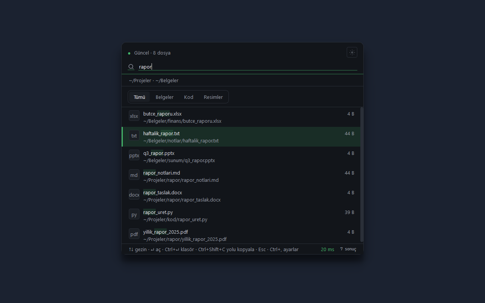</a><br>**[Akıllı Dosya Arama](akilli-dosya-arama-motoru/README.md)** — Ctrl+Space ile açılan Spotlight tarzı yerel dosya arama paleti. Dosya adı, içerik ve yazım hatasına dayanıklı arama; her şey cihazda kalır. | <a href="disk-alan-gorsellestirici/README.md">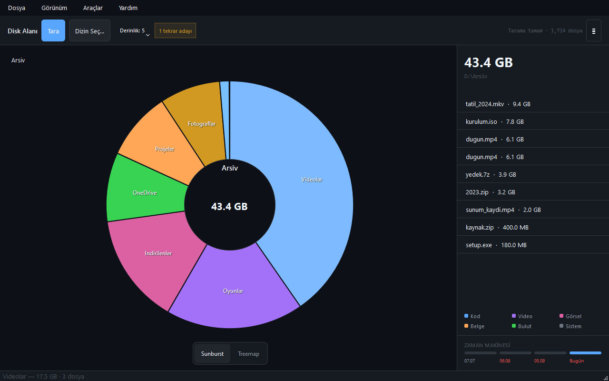</a><br>**[Disk Alanı Görselleştirici](disk-alan-gorsellestirici/README.md)** — Disk kullanımını sunburst ve treemap grafikleriyle gösterir; büyük dosyaları, temizlenebilir önbellekleri ve zaman içindeki büyümeyi bulup çöpe taşımanızı sağlar. |
| <a href="dosya-ve-klasor-karsilastirici/README.md">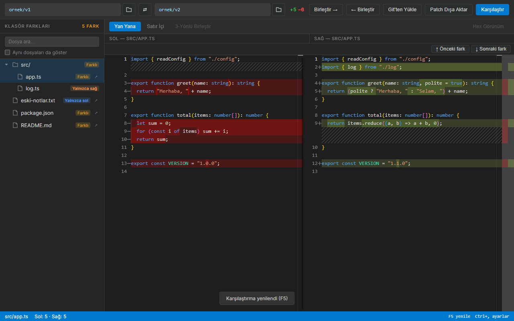</a><br>**[Dosya ve Klasör Karşılaştırıcı](dosya-ve-klasor-karsilastirici/README.md)** — İki dosyayı veya klasörü yan yana karşılaştıran, farkları birleştiren ve patch üreten yerel Electron uygulaması (Meld / WinMerge alternatifi). | <a href="dosya-yeniden-adlandirici/README.md">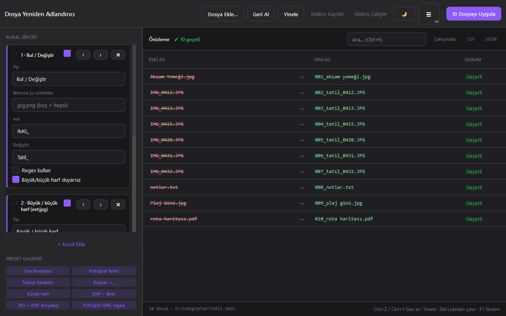</a><br>**[Dosya Yeniden Adlandırıcı](dosya-yeniden-adlandirici/README.md)** — Kural zinciri ve canlı önizlemeyle toplu dosya yeniden adlandırma; çakışmaları engeller, hiçbir dosyanın üzerine yazmaz, kalıcı geri al / yinele sunar. |
| <a href="hizli-dosya-arama-ve-acma-araci/README.md">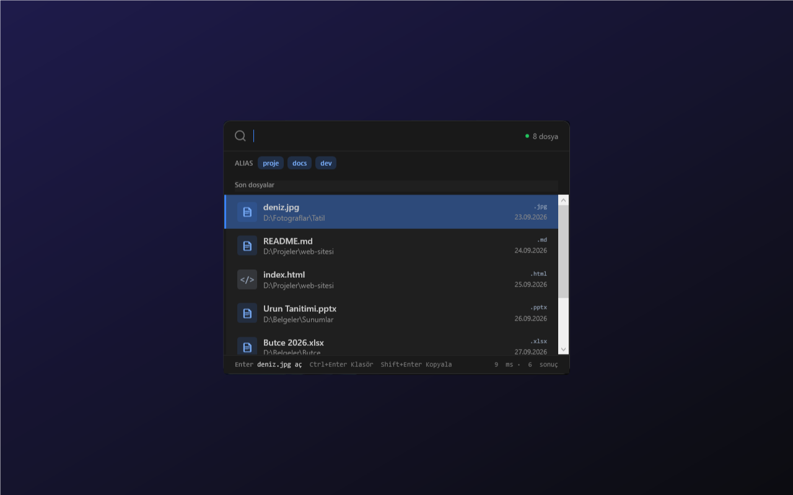</a><br>**[Hızlı Dosya Arama](hizli-dosya-arama-ve-acma-araci/README.md)** — Alt+F ile açılan, dosya adlarını yerel SQLite indeksinde yazdıkça arayıp Enter ile açan klavye odaklı Windows aracı (tepsi + tek örnek). | <a href="evrensel-uygulama-ve-dosya-baslatici/README.md">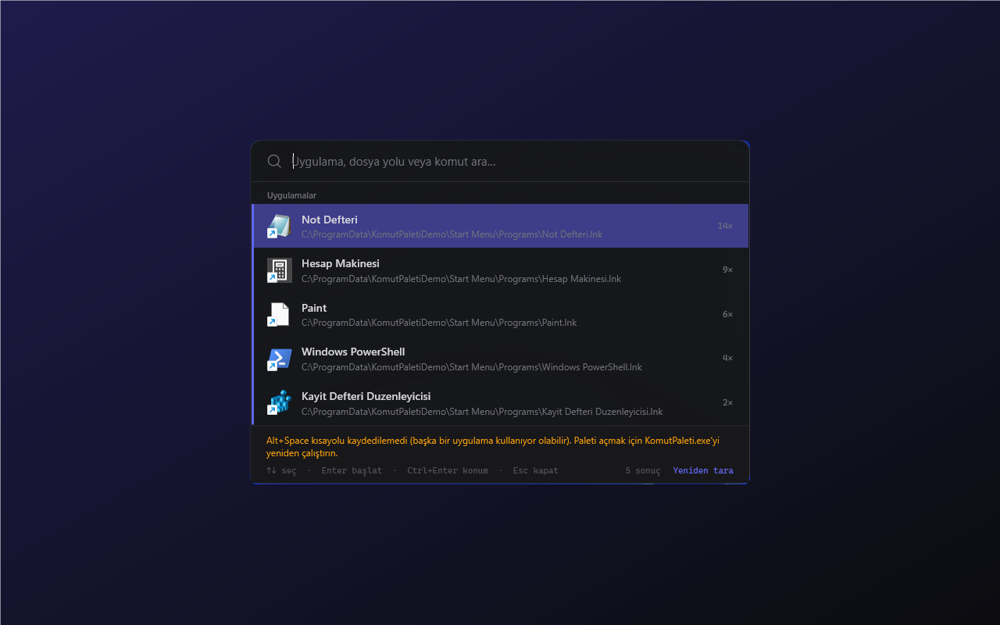</a><br>**[Komut Paleti](evrensel-uygulama-ve-dosya-baslatici/README.md)** — Alt+Space ile açılan Windows komut paleti: Başlat Menüsü uygulamalarını, dosya/klasör yollarını, PowerShell komutlarını ve web aramasını tek kutudan başlatır. |
| <a href="sistem-yoneticisi-paketi/README.md">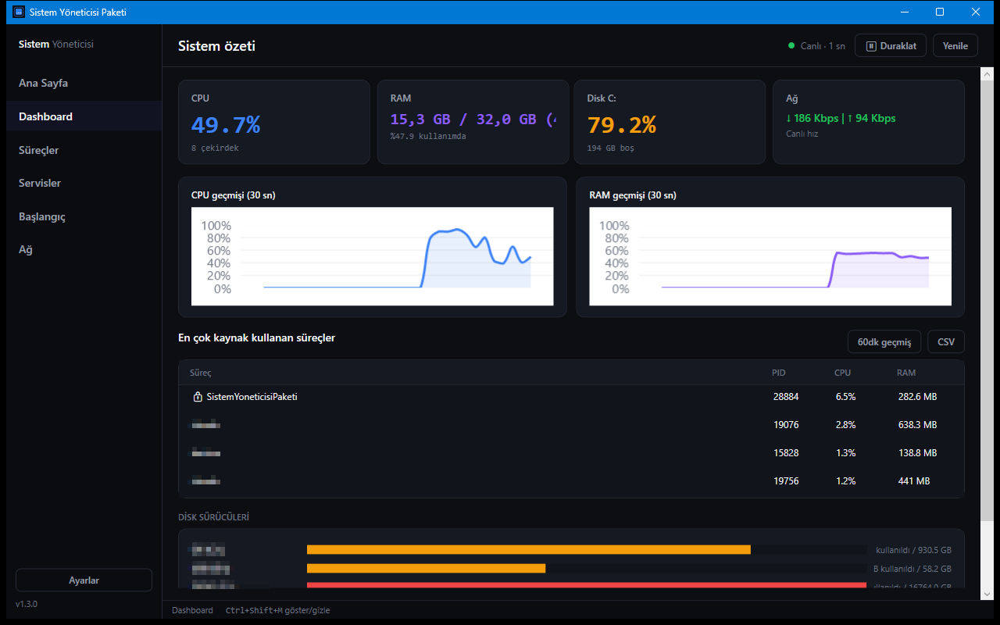</a><br>**[Sistem Yöneticisi Paketi](sistem-yoneticisi-paketi/README.md)** — Telemetrisiz yerel sistem monitörü: CPU, RAM, disk ve ağ izleme ile süreç, servis, başlangıç öğesi ve bağlantı yönetimi. Kritik süreç ve servisler korunur; başlangıç kaldırmaları geri alınabilir. | <a href="tekrarlanan-dosya-bulucu/README.md">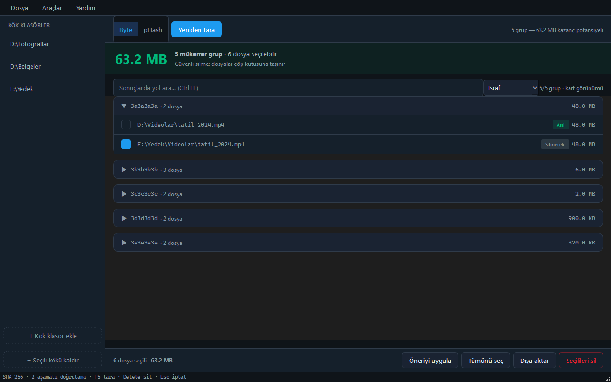</a><br>**[Tekrarlanan Dosya Bulucu](tekrarlanan-dosya-bulucu/README.md)** — Aynı içerikli dosyaları SHA-256 ile (isteğe bağlı benzer görselleri pHash ile) bulur ve kopyaları güvenle Geri Dönüşüm Kutusu'na taşır. |

### Verimlilik (10)

| | |
|---|---|
| <a href="hizli-not-alma-ve-gorev-listesi/README.md">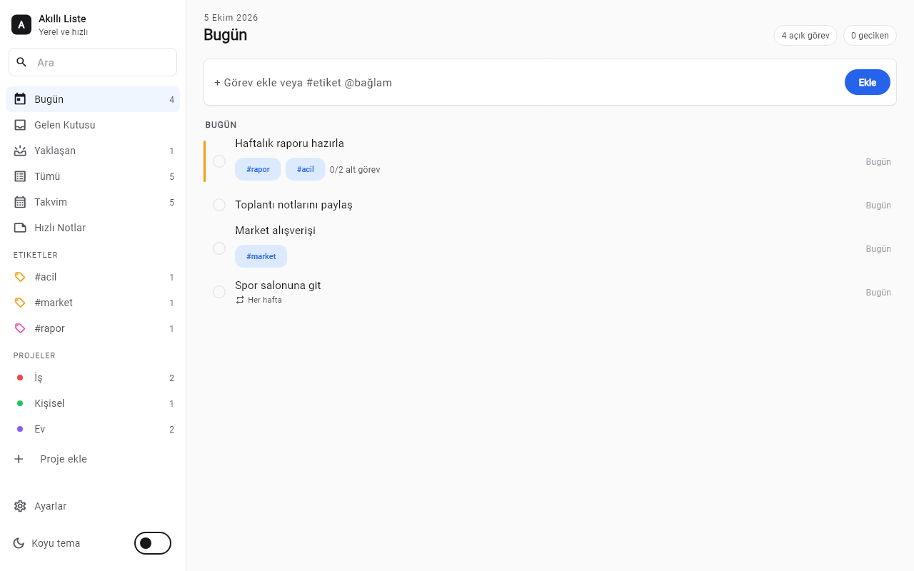</a><br>**[Akıllı Liste](hizli-not-alma-ve-gorev-listesi/README.md)** — Görevleri, projeleri, etiketleri ve hızlı notları yerel SQLite veritabanında tutan; tekrar, alt görev ve otomatik dosya yedeği destekleyen Todoist tarzı görev listesi. | <a href="aliskanlik-takipcisi/README.md">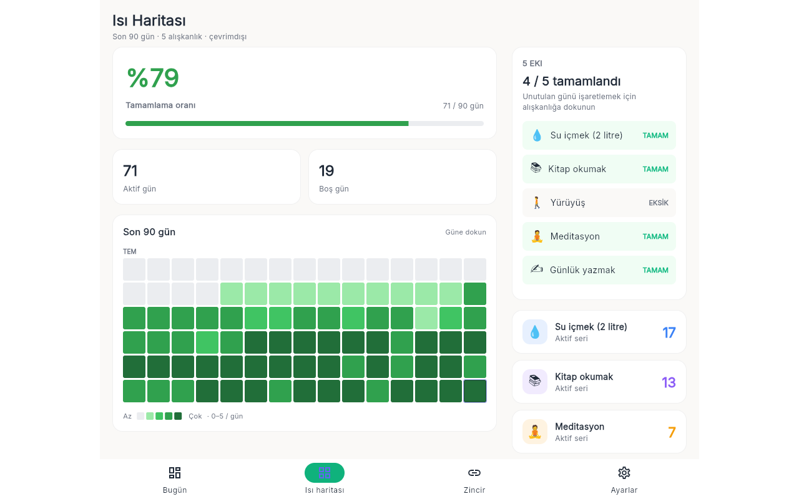</a><br>**[Alışkanlık Takipçisi](aliskanlik-takipcisi/README.md)** — Günlük ve haftalık alışkanlıkları seri sayacı, esnek seri ve 90 günlük ısı haritasıyla takip eden, verisini yalnızca cihazda tutan uygulama. |
| <a href="ekran-zamani-ve-uygulama-kullanim-takibi/README.md"></a><br>**[Ekran Zamanı](ekran-zamani-ve-uygulama-kullanim-takibi/README.md)** — Hangi uygulamada ne kadar vakit geçirdiğinizi ölçen, kategorilere ayıran ve yalnızca bu bilgisayarda saklayan WinUI 3 uygulaması. Günlük/haftalık özet, odak hedefleri ve isteğe bağlı tarayıcı eklentisi içerir. | <a href="gorsel-not-ve-beyin-haritasi-araci/README.md">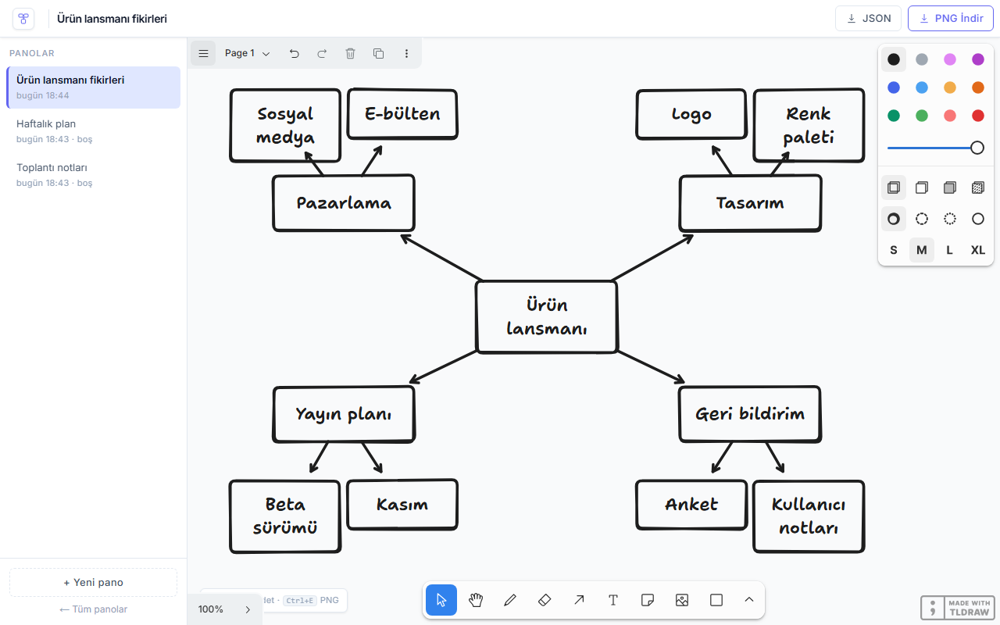</a><br>**[Görsel Not ve Beyin Haritası](gorsel-not-ve-beyin-haritasi-araci/README.md)** — tldraw tuvali üzerinde pano oluşturup yerel SQLite'a otomatik kaydeden çevrimdışı not ve beyin haritası aracı. PNG ve JSON dışa aktarma ile .tldr içe aktarma destekler. |
| <a href="markdown-not-defteri/README.md">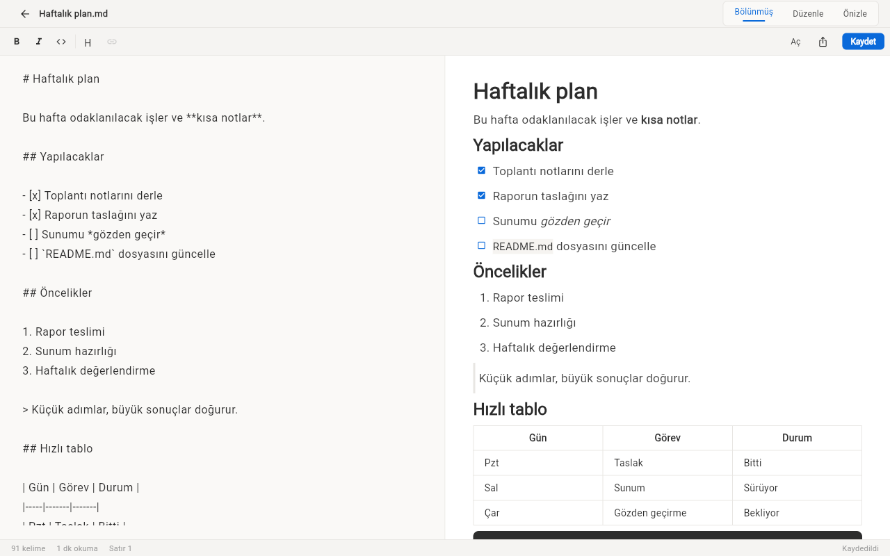</a><br>**[Markdown Not Defteri](markdown-not-defteri/README.md)** — Yerel .md dosyalarını ve hızlı notları bölünmüş editör ile canlı önizlemede düzenleyen, otomatik kaydeden ve HTML/Markdown olarak dışa aktaran not defteri. | <a href="zaman-takip-ve-pomodoro-araci/README.md">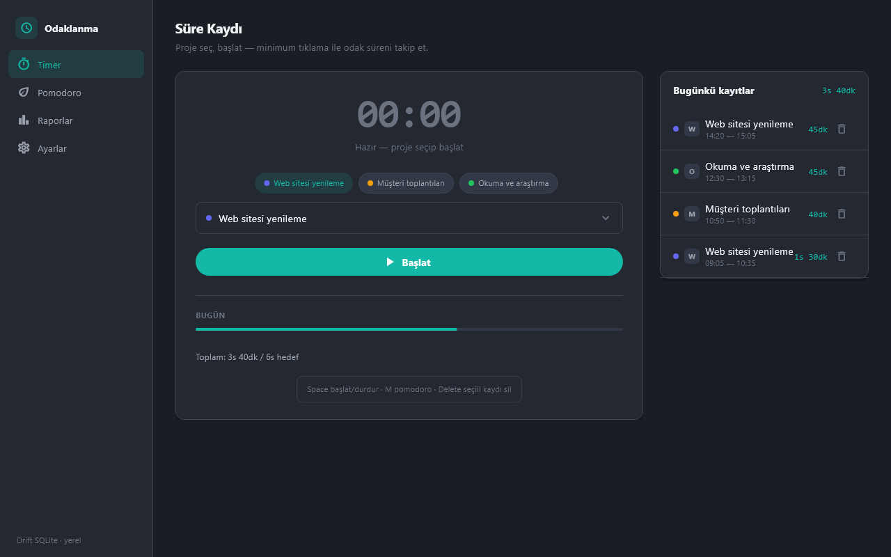</a><br>**[Odaklanma — Zaman Takip ve Pomodoro](zaman-takip-ve-pomodoro-araci/README.md)** — Proje bazlı süre kaydı, günlük rapor ve Pomodoro sayacı sunan Windows masaüstü uygulaması. Veriler yerel SQLite'ta tutulur. |
| <a href="otomasyon-ve-makro-araci/README.md">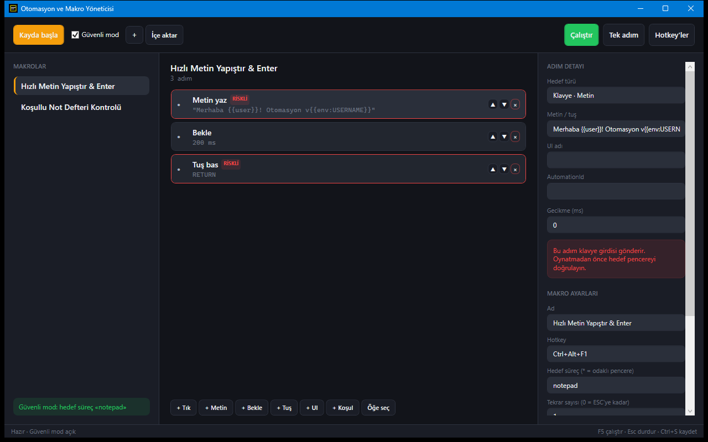</a><br>**[Otomasyon ve Makro Aracı](otomasyon-ve-makro-araci/README.md)** — Fare ve klavye adımlarını kaydedip düzenleyen ve tekrar oynatan Windows makro aracı. Güvenli mod, riskli adım onayı, değişkenler, zamanlayıcı ve fiziksel Esc ile acil durdurma içerir. | <a href="clipboard-gecmisi-yoneticisi/README.md">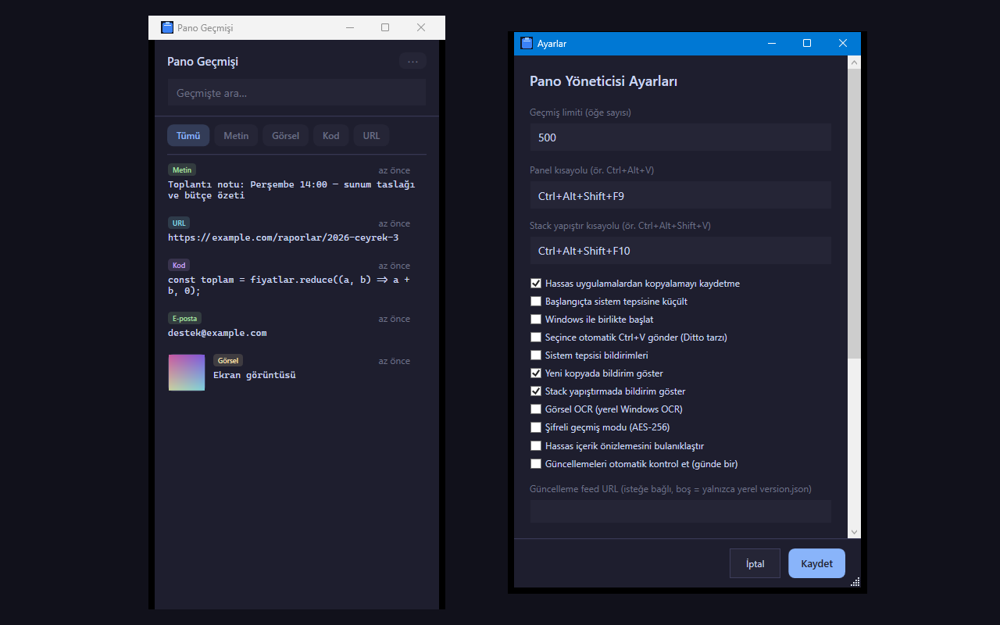</a><br>**[Pano Geçmişi Yöneticisi](clipboard-gecmisi-yoneticisi/README.md)** — Kopyalanan metin, bağlantı, kod, görsel ve dosya yollarını yerel SQLite'ta saklayan, global kısayolla açılan sistem tepsisi pano geçmişi aracı. |
| <a href="hizli-qr-kod-ve-barkod-olusturucu-okuyucu/README.md">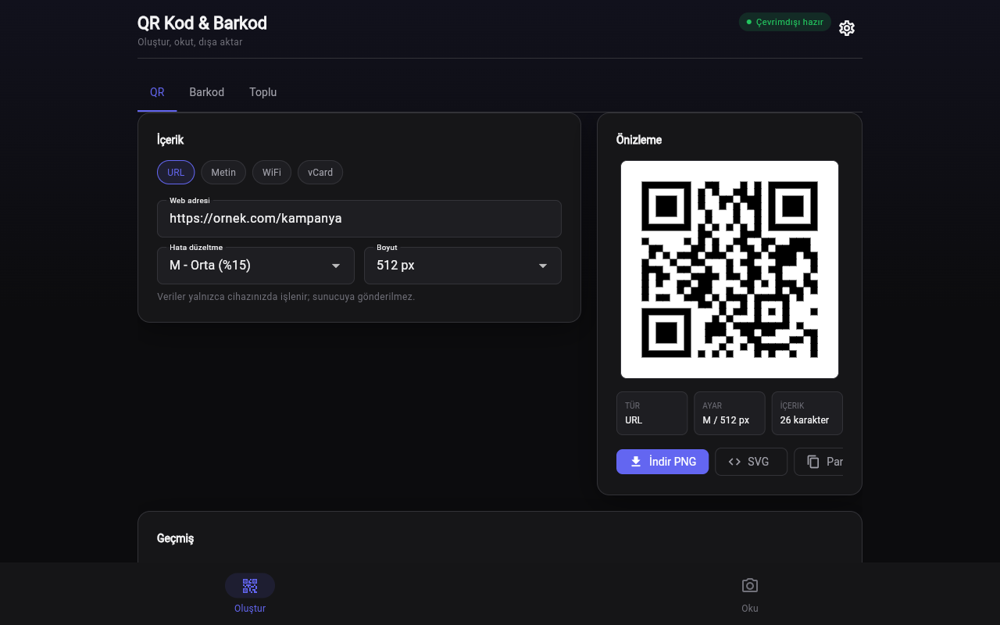</a><br>**[QR Kod & Barkod](hizli-qr-kod-ve-barkod-olusturucu-okuyucu/README.md)** — URL, metin, Wi-Fi ve vCard için QR kod ile Code128/EAN-13 barkod üreten, görselden ve kameradan kod okuyan araç. Toplu ZIP üretimi dahildir; tüm işlemler çevrimdışı yapılır. | <a href="takvim-ve-zamanlayici/README.md">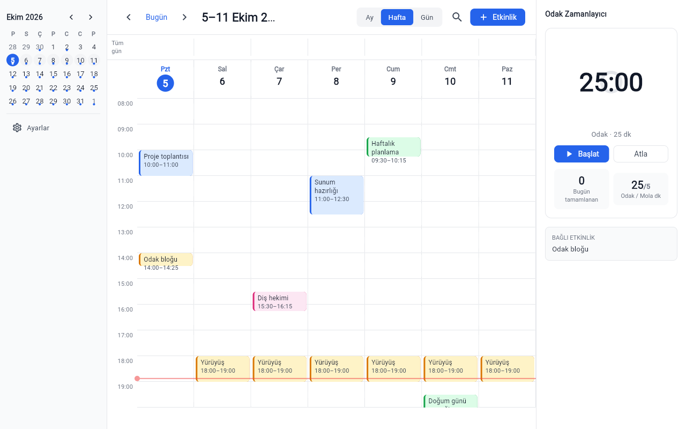</a><br>**[Takvim ve Zamanlayıcı](takvim-ve-zamanlayici/README.md)** — Türkçe, çevrimdışı takvim: ay/hafta/gün görünümü, tekrarlayan etkinlikler, doğal dil girişi, ICS/JSON aktarımı ve entegre Pomodoro zamanlayıcı. |

### Geliştirici Araçları (7)

| | |
|---|---|
| <a href="yerel-webhook-test-araci/README.md">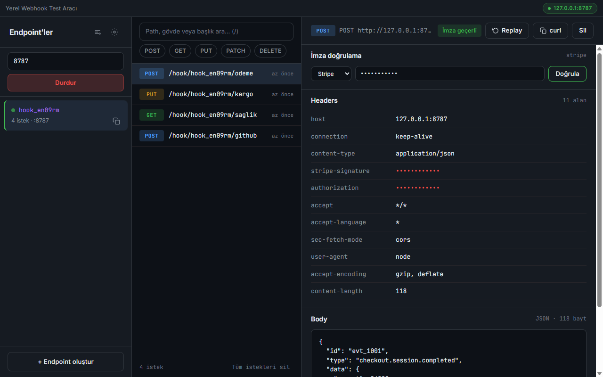</a><br>**[HookYerel — Yerel Webhook Test Aracı](yerel-webhook-test-araci/README.md)** — Webhook isteklerini internete açmadan 127.0.0.1 üzerinde yakalayan, mock yanıt veren ve Stripe/GitHub/Shopify imzalarını doğrulayan masaüstü aracı. | <a href="json-formatlayici-ve-dogrulayici/README.md">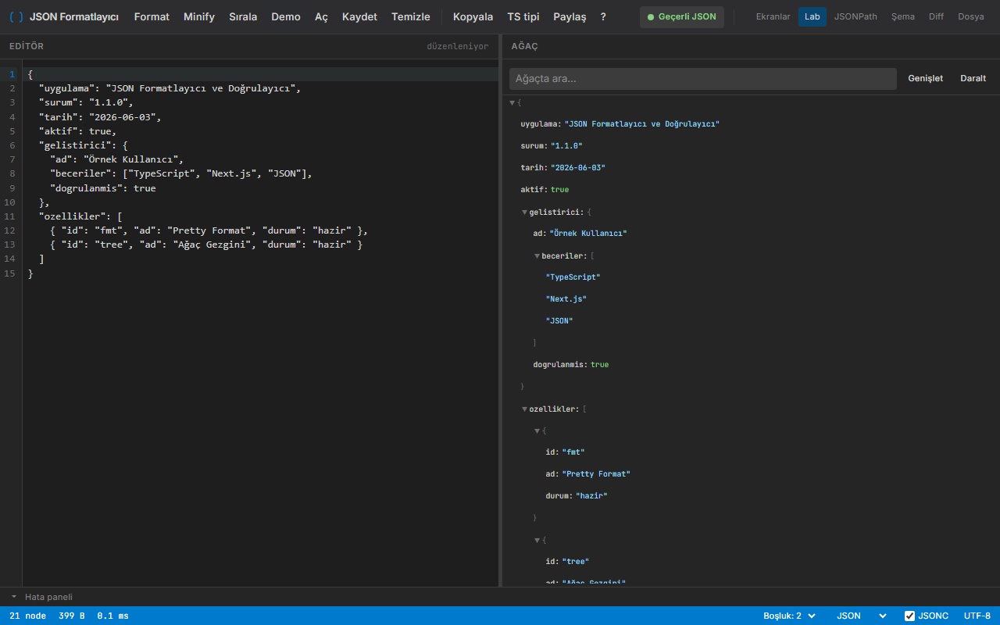</a><br>**[JSON Formatlayıcı ve Doğrulayıcı](json-formatlayici-ve-dogrulayici/README.md)** — JSON'u yerelde formatlayan, doğrulayan, JSONPath/jq-lite ile sorgulayan ve iki JSON'u satır satır karşılaştıran araç. Şema doğrulama, ağaç görünümü ve TypeScript tipi üretimi içerir. |
| <a href="kod-parcasi-snippet-yoneticisi/README.md">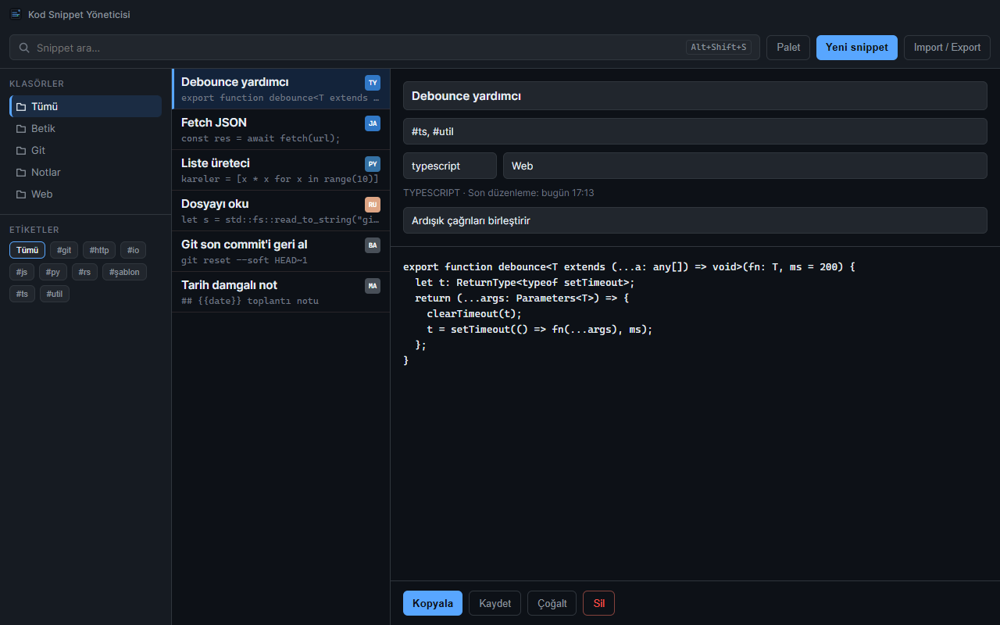</a><br>**[Kod Parçası Snippet Yöneticisi](kod-parcasi-snippet-yoneticisi/README.md)** — Kod parçalarını yerelde saklayan, Alt+Shift+S arama paletiyle her yerden kopyalanabilen snippet yöneticisi. Etiket, klasör, yer tutucu ve JSON içe/dışa aktarma destekler. | <a href="kodsuz-web-kaziyici-scraper/README.md">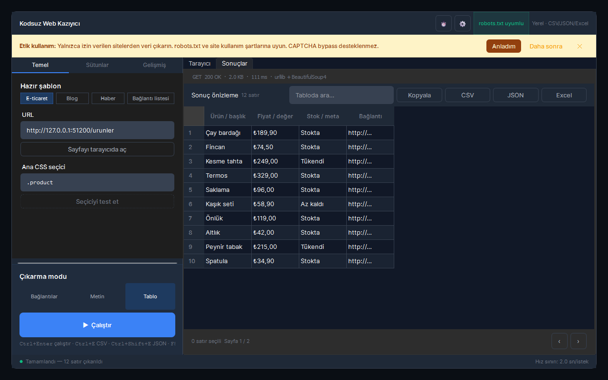</a><br>**[Kodsuz Web Kazıyıcı](kodsuz-web-kaziyici-scraper/README.md)** — URL ve CSS seçici ile kod yazmadan web verisi çıkaran PySide6 uygulaması; gömülü tarayıcı, robots.txt uyumu ve CSV/JSON/Excel dışa aktarma sunar. |
| <a href="hizli-metin-manipulasyon-ve-donusturucu-araclar/README.md">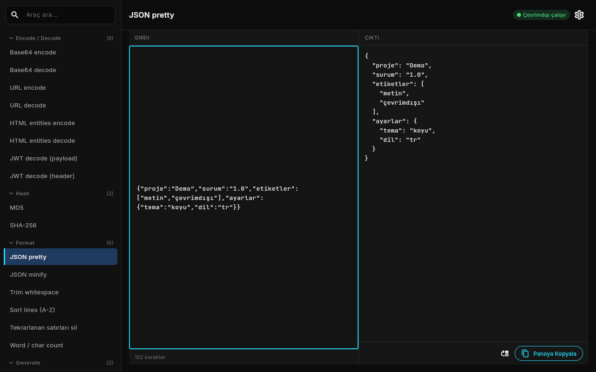</a><br>**[Metin Dönüştürücü](hizli-metin-manipulasyon-ve-donusturucu-araclar/README.md)** — Base64, URL, JWT, hash, JSON, UUID ve Türkçe büyük/küçük harf dahil 29 metin aracı; tüm dönüşümler çevrimdışı ve cihazda yapılır. | <a href="proje-launcher/README.md">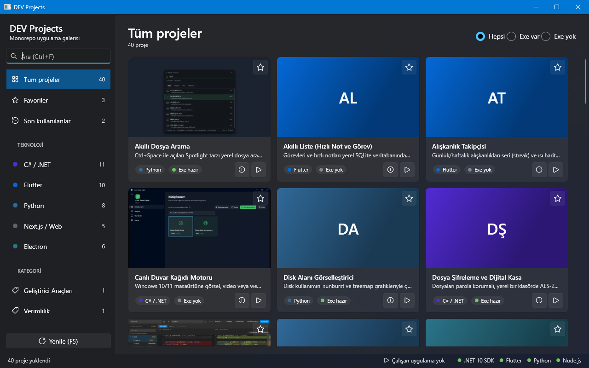</a><br>**[Proje Launcher](proje-launcher/README.md)** — Monorepodaki tüm uygulamaları ekran görüntülü kartlarla listeleyen, arayıp filtreleyen ve tek tıkla açan WPF galeri (DevProjects.exe). |
| <a href="regex-test-ve-ogrenme-araci/README.md">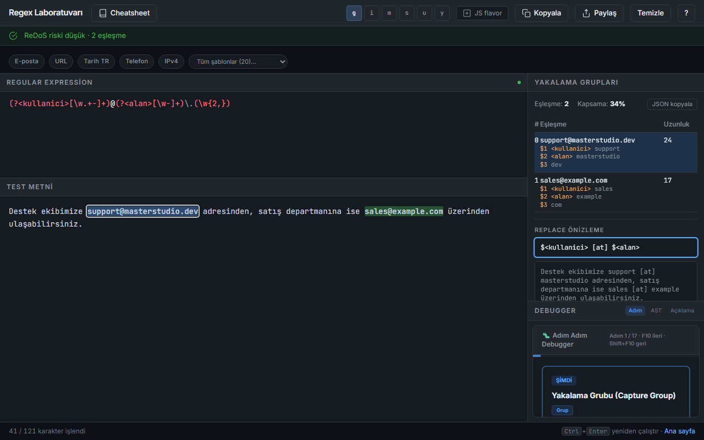</a><br>**[Regex Test ve Öğrenme Aracı](regex-test-ve-ogrenme-araci/README.md)** — Düzenli ifadeleri canlı eşleşme vurgusu, yakalama grupları ve replace önizlemesiyle test eden; adım adım debugger, ReDoS uyarısı ve aranabilir Türkçe cheatsheet sunan araç. |  |

### Medya ve Ekran (4)

| | |
|---|---|
| <a href="gelismis-ekran-goruntusu-ve-not-alma-araci/README.md">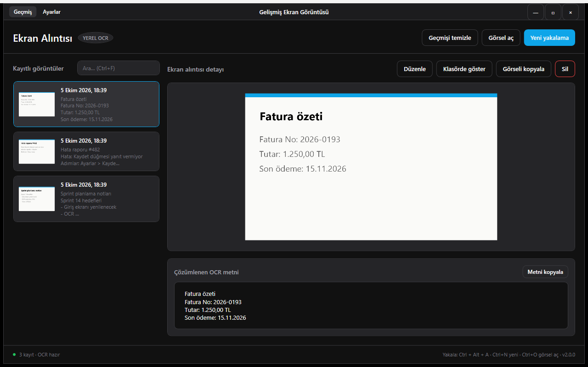</a><br>**[Gelişmiş Ekran Görüntüsü](gelismis-ekran-goruntusu-ve-not-alma-araci/README.md)** — Global kısayolla ekran yakalayan, işaretleme/pikselleştirme düzenleyicisi ve çevrimdışı OCR ile aranabilir geçmiş tutan WPF aracı. | <a href="hizli-ekran-kaydi-ve-gif-olusturucu/README.md">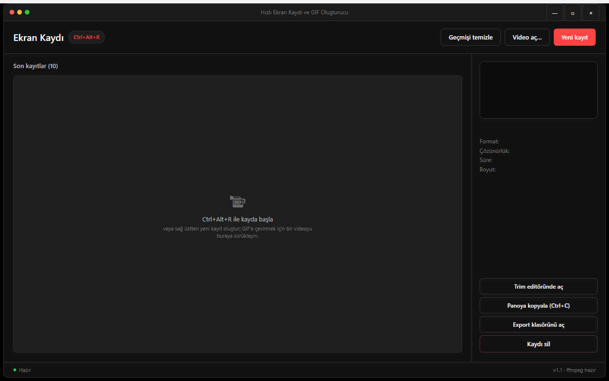</a><br>**[Hızlı Ekran Kaydı ve GIF](hizli-ekran-kaydi-ve-gif-olusturucu/README.md)** — Ekranın seçili bölgesini kaydedip kırpan ve GIF ya da MP4 olarak dışa aktaran WPF uygulaması. Tüm işlem yerelde ffmpeg ile yapılır; Ctrl+Alt+R global kısayolu vardır. |
| <a href="minimalist-podcast-uygulamasi/README.md">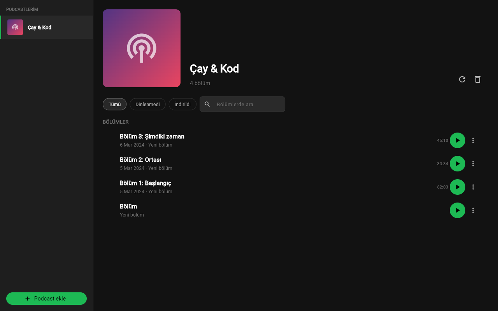</a><br>**[Minimalist Podcast](minimalist-podcast-uygulamasi/README.md)** — Koyu temalı, reklamsız RSS podcast dinleyici: abonelik, OPML içe/dışa aktarma, sıra, uyku zamanlayıcı ve offline indirme. Veriler cihazda yerel SQLite'ta tutulur. | <a href="yerel-sesli-metin-dokumu-araci/README.md">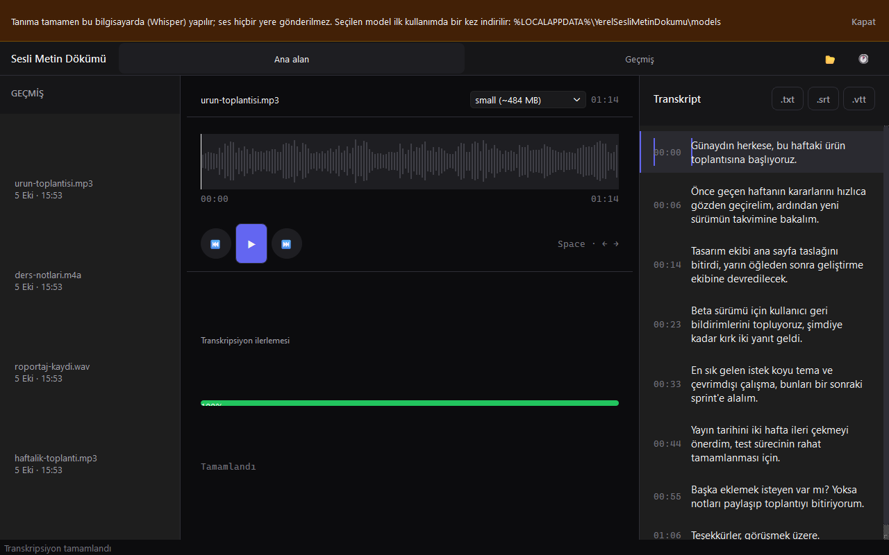</a><br>**[Yerel Sesli Metin Dökümü Aracı](yerel-sesli-metin-dokumu-araci/README.md)** — Ses dosyalarını faster-whisper ile tamamen bilgisayarınızda Türkçe metne çeviren araç; zaman damgalı transkript, dalga formu oynatıcı ve TXT/SRT/VTT dışa aktarma sunar. |

### Tasarım ve Görsel (4)

| | |
|---|---|
| <a href="canli-duvar-kagidi-motoru/README.md">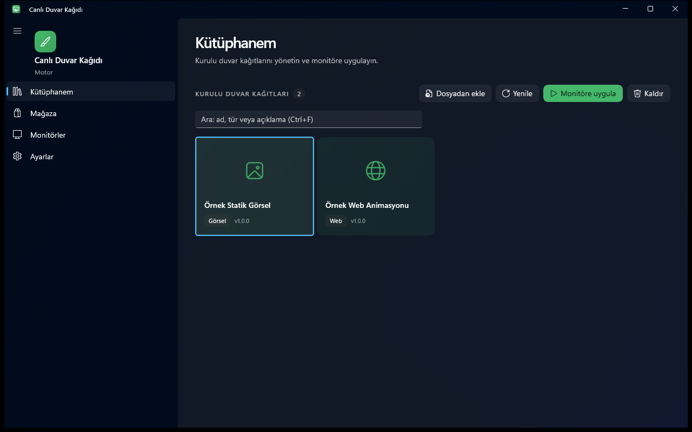</a><br>**[Canlı Duvar Kağıdı Motoru](canli-duvar-kagidi-motoru/README.md)** — Windows masaüstüne görsel, video veya HTML/JS tabanlı canlı duvar kağıtları yerleştiren WinUI 3 uygulaması. Monitör başına ayrı duvar kağıdı, tam ekranda otomatik duraklatma ve self-host katalog desteği. | <a href="ekran-renk-secici/README.md">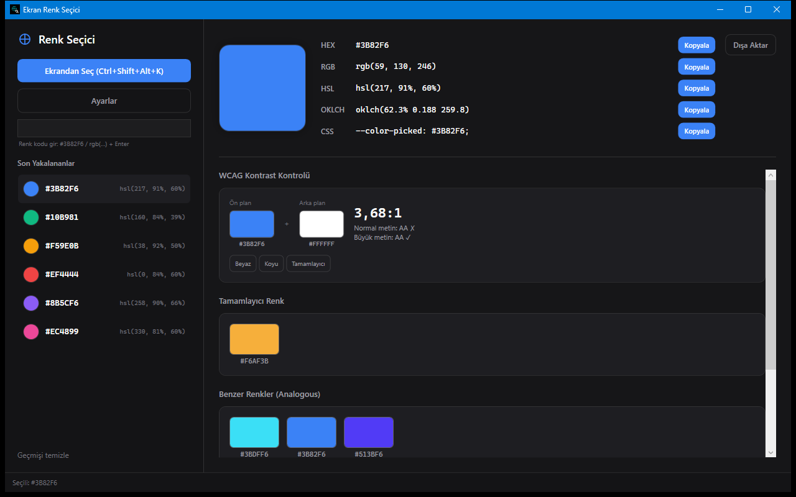</a><br>**[Ekran Renk Seçici](ekran-renk-secici/README.md)** — Global kısayolla ekrandaki herhangi bir pikselin rengini büyüteçle yakalayıp HEX/RGB/HSL/OKLCH olarak panoya kopyalayan tepsi uygulaması; WCAG kontrast, palet ve token dışa aktarma içerir. |
| <a href="gorsel-arama-ve-toplu-donusturucu/README.md">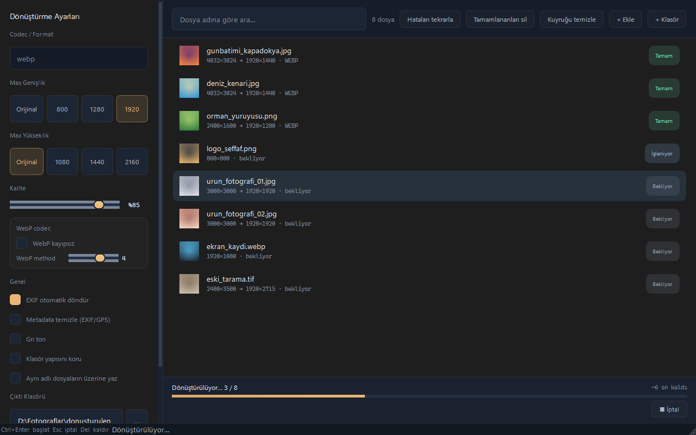</a><br>**[Görsel Arama ve Toplu Dönüştürücü](gorsel-arama-ve-toplu-donusturucu/README.md)** — Görselleri kuyruğa toplayıp WebP, JPEG, PNG veya AVIF'e toplu dönüştürür, küçültür ve EXIF/GPS bilgisini temizler. Orijinalleri asla ezmez. | <a href="renk-secici-ve-palet-uretici/README.md">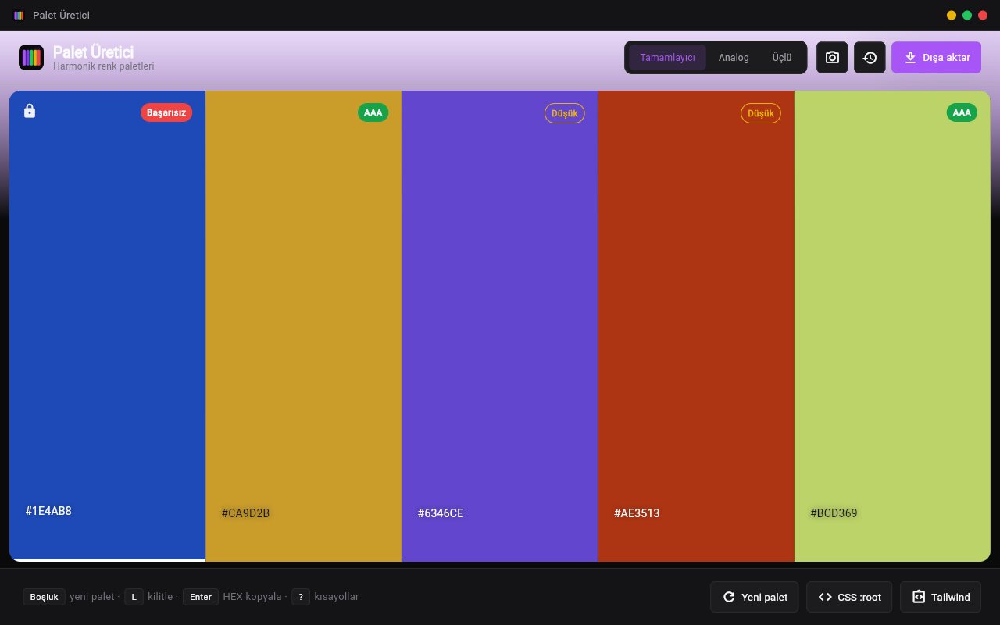</a><br>**[Renk Seçici ve Palet Üretici](renk-secici-ve-palet-uretici/README.md)** — Harmonik 5 renkli palet üretir, WCAG kontrastını gösterir; paleti CSS, SCSS, Tailwind veya JSON olarak dışa aktarır. Görselden palet ve tema çıkarabilir. |

### İletişim ve Okuma (4)

| | |
|---|---|
| <a href="e-posta-istemcisi-ve-takip-araci/README.md">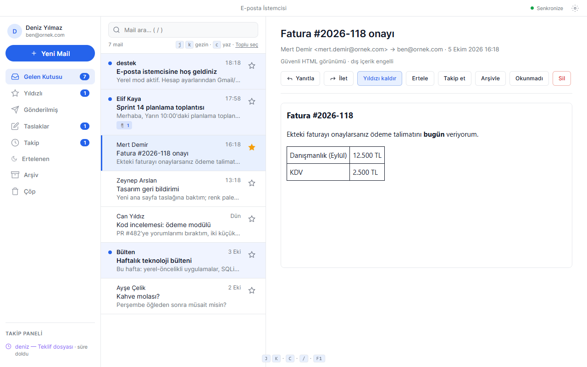</a><br>**[E-posta İstemcisi ve Takip Aracı](e-posta-istemcisi-ve-takip-araci/README.md)** — IMAP/SMTP hesaplarını yerel SQLite önbelleğiyle yöneten masaüstü e-posta istemcisi. Yanıt takibi, erteleme, şablonlar ve geri al cihazda çalışır; şifreler OS güvenli depolamasında tutulur. | <a href="kisisellestirilebilir-haber-ve-icerik-akis-paneli/README.md">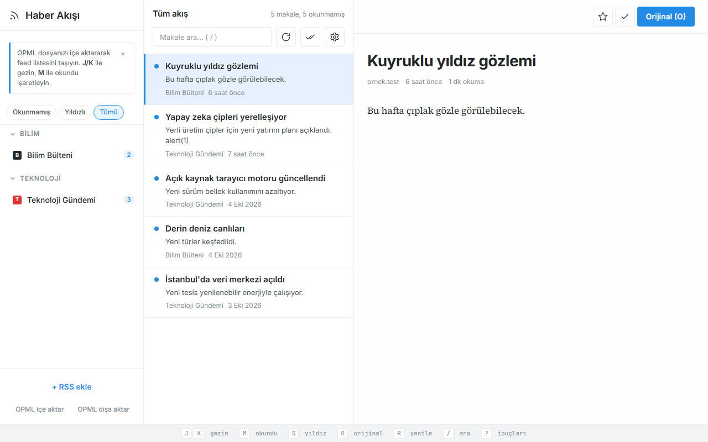</a><br>**[Haber Akış Paneli](kisisellestirilebilir-haber-ve-icerik-akis-paneli/README.md)** — RSS/Atom akışlarını yerel SQLite'ta toplayan üç sütunlu haber okuyucu. Klasörler, OPML içe/dışa aktarma, okundu/yıldız ve J/K klavye gezinmesi. |
| <a href="web-clipper-ve-okuma-listesi/README.md">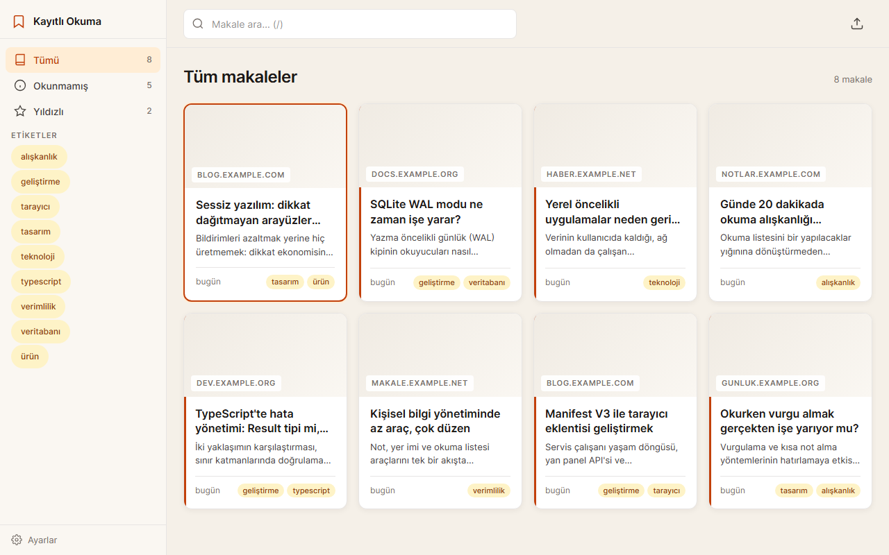</a><br>**[Kayıtlı Okuma — Web Clipper ve Okuma Listesi](web-clipper-ve-okuma-listesi/README.md)** — Sayfaları kaydedip yan panelde okumanızı sağlayan Chrome (MV3) eklentisi; isteğe bağlı Next.js web arayüzü ve masaüstü sürümüyle RSS/Omnivore içe aktarma, vurgu ve notlar sunar. | <a href="takim-iletisim-ve-sohbet-araci/README.md">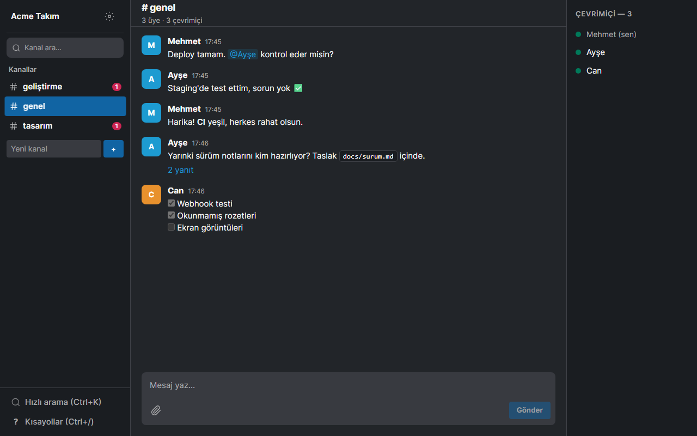</a><br>**[Takım İletişim ve Sohbet Aracı](takim-iletisim-ve-sohbet-araci/README.md)** — Kendi sunucunuzda veya masaüstünde çalışan Slack benzeri anlık takım sohbeti. Kanallar, DM, thread, dosya eki, CI webhook'ları ve KVKK dışa aktarma. |

### Güvenlik ve Gizlilik (2)

| | |
|---|---|
| <a href="dosya-sifreleme-ve-dijital-kasa/README.md"></a><br>**[Dijital Kasa](dosya-sifreleme-ve-dijital-kasa/README.md)** — Dosyaları parola korumalı yerel bir klasörde AES-256-GCM ve Argon2id ile şifreleyen, ekleme, kasaya taşıma, çıkarma ve otomatik kilit sunan WPF kasa. | <a href="metadata-temizleyici/README.md">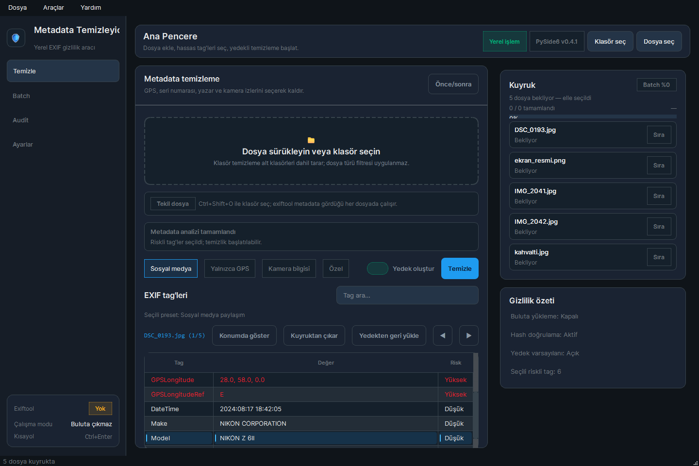</a><br>**[Metadata Temizleyici](metadata-temizleyici/README.md)** — Fotoğraf ve PDF'lerdeki EXIF/GPS/XMP/IPTC izlerini yerelde, yedekli ve toplu olarak temizler. Komut satırı aracı da içerir. |

### Yaşam ve Öğrenme (2)

| | |
|---|---|
| <a href="egitim-ve-ogrenme-platformu/README.md"></a><br>**[Öğrenim Pazarı](egitim-ve-ogrenme-platformu/README.md)** — Kurs kataloğu, ders ilerlemesi ve sunucuda puanlanan quiz içeren yerel eğitim platformu. Demo kursla gelir, veriler SQLite'ta tutulur. | <a href="yemek-tarifi-yoneticisi-ve-menu-planlayici/README.md">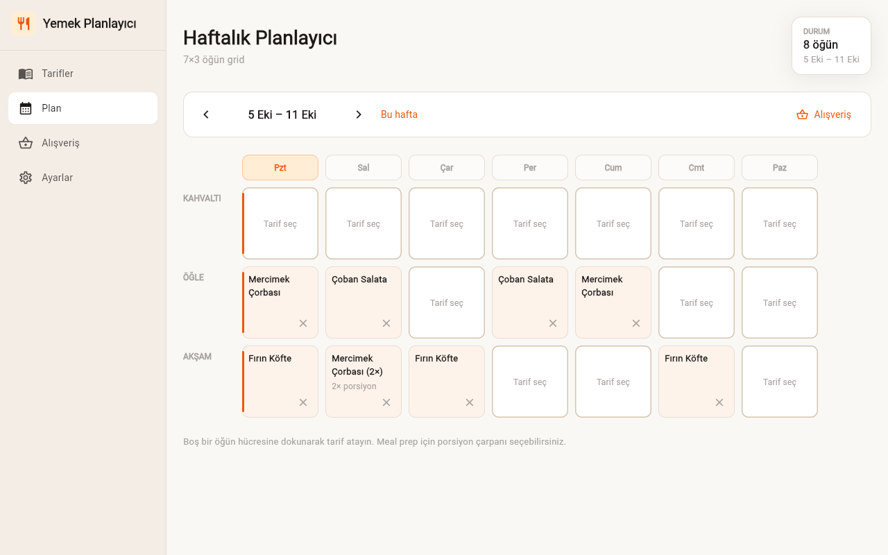</a><br>**[Yemek Planlayıcı](yemek-tarifi-yoneticisi-ve-menu-planlayici/README.md)** — Yerel tarif arşivi, haftalık 7×3 menü planı ve plandan otomatik birleşik alışveriş listesi; porsiyon ölçekleme ve kiler desteği. |
