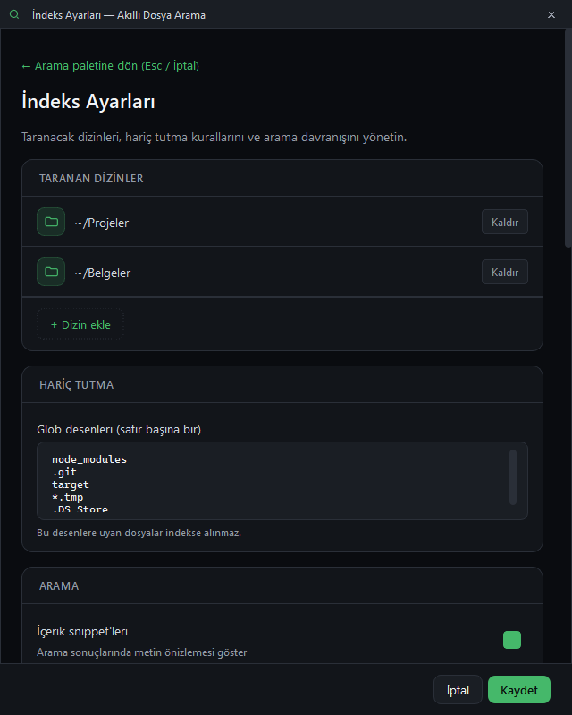

# Akıllı Dosya Arama Motoru

Windows'ta **Ctrl+Space** ile açılan, seçtiğiniz klasörlerde dosya adı ve içerik araması yapan Spotlight tarzı arama paleti; her şey yerelde kalır.


## Özellikler
- **Arama:** dosya adı + (isteğe bağlı) metin/kod dosyası içeriği; yazım hatasına dayanıklı bulanık eşleşme (rapidfuzz); içerik eşleşmelerinde metin parçası.
- **Sorgu ekleri:** `ext:py`, `kod`, `içerik`; filtre çipleri Tümü / Belgeler / Kod / Resimler (`Ctrl+1…4`).
- **İndeks:** SQLite FTS5, isteğe bağlı Tantivy birincil indeks; watchdog ile canlı güncelleme; zamanlanmış gece yeniden indeksleme; indeksi dışa/içe aktarma.
- **Sonuçlar:** klavyeyle gezinme, aç / klasörde göster / yolu kopyala; sağ tık menüsü; resim küçük resimleri.
- **Geçmiş:** boş palette son aramalar, boş kutuda `↑` son aramayı getirir; ayarlardan temizlenir.
- **Entegrasyon:** isteğe bağlı Everything köprüsü; sistem tepsisinde arka planda çalışır.
- **Erişilebilirlik:** tüm düğme/onay kutularında ekran okuyucu adları, görünür klavye odağı, koyu tema.



## Hızlı başlangıç
| Ne | Komut |
|---|---|
| Hazır exe | `dist\akilli-dosya-arama-motoru\AkilliDosyaArama.exe` (`--background` ile yalnız tepside başlar) |
| Kaynaktan çalıştır | `.\run.ps1` (`.venv` yoksa kurar, `main.py --show` ile açar) |
| Testler | `.\run.ps1 -Check` (birim + duman, pencere açmaz) |
| Arayüz testleri | `.\run.ps1 -UiTest` (pytest-qt, gerçek pencereler) |
| Exe üretme | `.\publish.ps1` → `dist\akilli-dosya-arama-motoru\` |
| Ekran görüntüleri | `.\.venv\Scripts\python.exe scripts\ekran_goruntusu.py` (demo klasörle, ekranı kopyalamadan) |

İlk kullanımda **Ctrl+,** (veya tepsi menüsü → İndeks ayarları) ile klasör ekleyip **Yeniden indeksle**'ye basın.

## Kullanım
Ctrl+Space → yazın → `↑/↓` ile seçin → `Enter` ile açın. Filtre için çiplere tıklayın veya `Ctrl+1…4`; sorguya `ext:pdf` ekleyin.
Sonuca sağ tıklayarak klasörünü açabilir ya da yolunu kopyalayabilirsiniz. Panel dışına tıklamak veya boş kutuda `Esc` paleti kapatır.

| Kısayol | İşlev |
|---|---|
| `Ctrl+Space` | Paleti aç / kapat (genel) |
| `↑` / `↓` | Sonuçlarda gezin (boş kutuda `↑`: son arama) |
| `Enter` | Dosyayı aç |
| `Ctrl+Enter` | Klasörde göster |
| `Ctrl+Shift+C` | Tam yolu kopyala |
| `Ctrl+1` … `Ctrl+4` | Filtre: Tümü / Belgeler / Kod / Resimler |
| `Esc` | Metni temizle, boşsa kapat |
| `Ctrl+,` | İndeks ayarları |

## Veri ve gizlilik
- Ayarlar, FTS5/Tantivy indeksi ve arama geçmişi: `%USERPROFILE%\.akilli-dosya-arama\`.
- `AKILLI_ARAMA_DATA_DIR` ortam değişkeni bu klasörü değiştirir (testler ve taşınabilir kullanım için).
- Ağ erişimi yok. Everything köprüsü yalnızca yerel Everything sürecine bağlanır.

## Mimari / analiz
- **Yığın:** Python 3.13, PySide6 6.11.2, watchdog 6.0.0, rapidfuzz 3.14.6, tantivy 0.26.2; PyInstaller 6.22.3 (onedir); test: pytest 9.1.1 + pytest-qt 4.5.0.
- **Klasörler:**
  ```
  main.py          giriş: QApplication, tepsi, genel kısayol, watcher, zamanlayıcı
  ui/              spotlight_window (palet), components (panel, satır, rozet), settings_dialog, tray_menu, theme
  utils/           file_search (sorgu + os.walk yedeği), index_backend (FTS5/Tantivy seçimi), index_db, tantivy_index,
                   index_watcher (watchdog → delta), fuzzy_search, everything_bridge, search_history, settings, config
  scripts/         ekran_goruntusu.py
  tests/           birim + duman testleri; tests/ui/ pytest-qt arayüz testleri
  ```
- **Veri akışı:** tuş → 200 ms debounce → `SearchWorker` (QThread) → `search_files` → indeks (Tantivy/FTS5) + bulanık + içerik + Everything katmanları → sonuç satırları. Dosya değişiklikleri watchdog → toplu delta → indeks.
- **Kararlar:** ağır işler QThread'de, UI hiç bloklanmaz; eski arama sonucu yenisini ezmesin diye sinyali kesilir. Tantivy Windows'ta canlı silmeyi güvenilir yapamadığı için canlı delta FTS5'e yazılır. Dosya adları RichText etiketlerde HTML olarak kaçışlanır.

## Testler
- `.\run.ps1 -Check`: 16 test (14 birim: sorgu ayrıştırma, ayarlar, FTS5/Tantivy, delta, bulanık, geçmiş; 2 duman).
- `.\run.ps1 -UiTest`: 23 pytest-qt testi — paletin, ayarlar diyaloğunun ve tepsi menüsünün her kontrolü. Envanter: [docs/arayuz-testi.md](docs/arayuz-testi.md).

## Bilinen sınırlar ve yol haritası
- Yalnızca Windows (genel kısayol `RegisterHotKey`, `explorer /select`). `Ctrl+Space` başka bir uygulamada kayıtlıysa kısayol alınamaz; tepsi ikonuna çift tıklayın.
- İçerik araması yalnızca metin/kod uzantılarında ve 512 KB'a kadar; PDF/Office içeriği indekslenmez.
- Kısayol değiştirme ve açık tema henüz yok.
