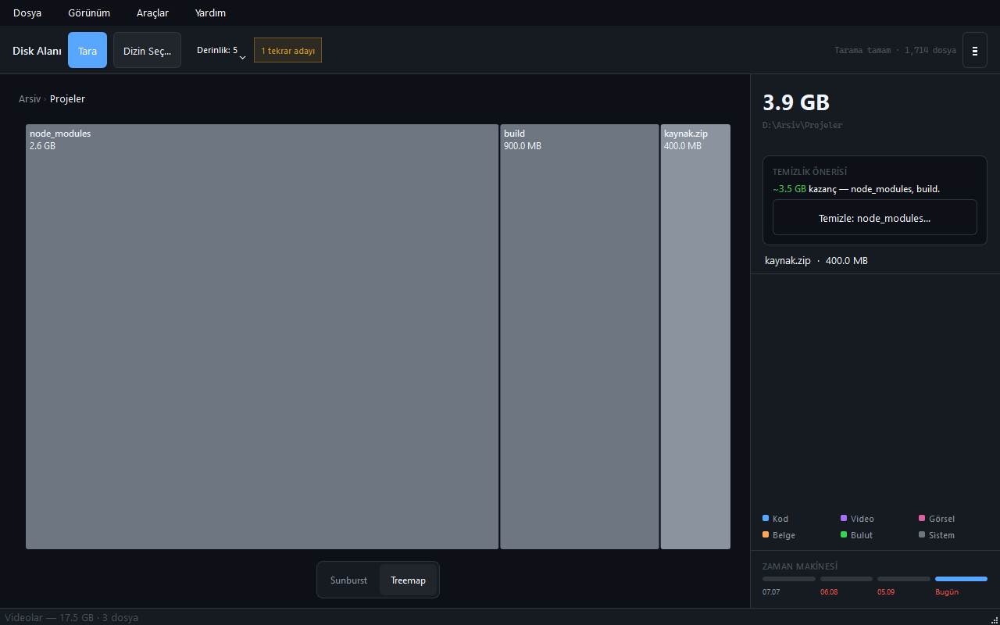
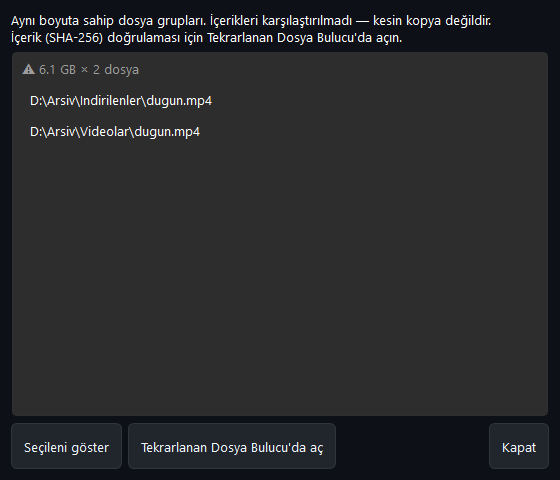

# Disk Alanı Görselleştirici

Disk kullanımını sunburst ve treemap grafikleriyle gösterip büyük dosyaları ve temizlenebilir klasörleri bulan PySide6 masaüstü uygulaması.


## Özellikler
- **Tarama:** sürücü ya da klasör; derinlik Hızlı (3) / Normal (5) / Tam; SQLite önbellek (`F5`), önbelleksiz yeniden tarama (`Shift+F5`); iptal; sembolik bağ / junction izlenmez, nokta klasörler (`.git`, `.venv`) sayılır.
- **Grafikler:** sunburst (büyük dilimlerde klasör adı) ve treemap; tıklayarak / Enter ile alt klasöre inme, yol çubuğu, `Backspace` üst klasör; klavyeyle tam kullanım (←→ seç, Delete çöpe taşı, Menü / `Shift+F10` sağ tık menüsü).
- **Kenar paneli:** seçili klasörün boyutu, 100 MB üzeri dosyalar (çift tık Explorer, sağ tık / Delete çöpe taşı), temizlik önerisi (`node_modules`, önbellekler, geçici dosyalar).
- **Zaman makinesi:** aynı klasörün son 4 taraması; her nokta bir öncekine göre büyüme/küçülmeyi gösterir, tıklayınca o tarama yüklenir.
- **Tekrar adayları:** aynı boyutlu dosya grupları; tek tıkla Tekrarlanan Dosya Bulucu'ya aktarım (içerik doğrulaması orada).
- **Dışa aktarma:** PNG, SVG, JSON, CSV, HTML. Son klasörler menüsü (son 8 kök), zamanlanmış tarama (tepsi bildirimi).
- **Güvenli silme:** her silme onay ister, Geri Dönüşüm Kutusu'na taşır; grafik, adaylar ve önbellek anında güncellenir.
- **Erişilebilirlik:** koyu tema, odak çerçevesi, ekran okuyucu adları, tüm işlevler klavyeyle.



## Hızlı başlangıç
| Ne | Komut |
|---|---|
| Hazır exe | `dist\disk-alan-gorsellestirici\DiskAlanGorsellestirici.exe` (repo kökünde; `_internal` ile birlikte taşıyın) |
| Kaynaktan çalıştır | `.\run.ps1` (`.venv` kurar, `requirements.txt` paketlerini yükler) |
| Testler | `.\run.ps1 -Check` (birim + entegrasyon, pencere açmaz) |
| Arayüz testleri | `.\run.ps1 -UiTest` (pytest-qt, gerçek pencereler) |
| Exe üretme | `.\publish.ps1` → `dist\disk-alan-gorsellestirici\` (önce testleri çalıştırır) |
| Kurulum / kaldırma | `.\install.ps1` / `.\uninstall.ps1` (`%LOCALAPPDATA%\Programs\DiskAlanGorsellestirici`) |
| Ekran görüntüleri | `.\.venv\Scripts\python.exe scripts\ekran_goruntusu.py` (uydurma örnek ağaçla, ekranı kopyalamadan) |

## Kullanım
1. `Ctrl+O` ile klasör seçin (ya da `F5` ile son klasörü tarayın). Tarama bitince odak grafiğe geçer.
2. Dilime tıklayın ya da ←/→ ile seçip Enter'a basın; `Backspace` ile geri çıkın.
3. Sağdaki panelde büyük dosyaları ve temizlik önerisini inceleyin; sağ tık / Delete ile çöpe taşıyın.
4. Rozetteki "N tekrar adayı" → Tekrarlanan Dosya Bulucu'da içerik doğrulaması.

| Kısayol | İşlev |
|---|---|
| `F5` / `Shift+F5` | Tara / önbelleği atlayarak tara |
| `Esc` | Taramayı iptal et; tarama yoksa köke dön |
| `Ctrl+O` | Dizin seç |
| `Ctrl+E` | Dışa aktar (PNG/SVG/JSON/CSV/HTML) |
| `Ctrl+1` / `Ctrl+2` | Sunburst / Treemap |
| `Ctrl+B` | Detay panelini aç/kapat |
| `Ctrl+D` | Tekrar adayları |
| `Ctrl+,` | Ayarlar |
| `Backspace` / `Alt+Home` | Üst klasör / köke dön |
| `←` `→` `↑` `↓` · `Enter` (grafikte) | Dilim seç · içine gir |
| `Delete` (grafik / büyük dosyalar) | Çöpe taşı (onaylı) |
| `Menü` / `Shift+F10` (grafikte) | Sağ tık menüsü |
| `F1` · `Ctrl+Q` | Yardım · Çık |

## Veri ve gizlilik
- `%LOCALAPPDATA%\DiskAlanGorsellestirici\`: `settings.json` (ayarlar, son klasörler), `scan_cache.db` (önbellek + tarama geçmişi).
- `LOCALAPPDATA` ortam değişkeni bu kökü değiştirir; testler ve `scripts/ekran_goruntusu.py` geçici klasör kullanır.
- Ağ erişimi yok, telemetri yok. Silme yalnızca kullanıcı onayıyla Geri Dönüşüm Kutusu'na yapılır.
- Tekrarlanan Dosya Bulucu köprüsü `%LOCALAPPDATA%\TekrarlananDosyaBulucu\handoff.json` yazar ve o uygulamayı yerel olarak başlatır.

## Mimari / analiz
- **Yığın:** Python 3.13, PySide6 6.11.2 (QtWidgets, QtSvg), Send2Trash 2.1.0; PyInstaller 6.22.3 (onedir, windowed); test: pytest 9.1.1 + pytest-qt 4.5.0.
- **Klasörler:**
  ```
  main.py            tek örnek (mutex), hoş geldiniz, tepsi ikonu
  core/              scanner + scan_worker (QThread), cache + history (SQLite), duplicates, categorizer,
                     export (JSON/CSV/HTML, çöp, Explorer), settings, tekrarlanan_bridge
  ui/main_window.py  menüler, kısayollar, tarama akışı, gezinme, silme, dışa aktarma
  ui/charts/         sunburst, treemap, keyboard.py (ortak klavye erişimi)
  ui/widgets/        yol çubuğu, kenar paneli, zaman çizelgesi, renk açıklaması, durum afişi
  ui/dialogs/        ayarlar, tekrar adayları, yardım, hakkında, hoş geldiniz
  scripts/           ekran_goruntusu.py
  tests/             birim/entegrasyon; tests/ui/ pytest-qt arayüz testleri
  ```
- **Veri akışı:** kök → `ScanWorker` (önbellek isabeti ya da `DirectoryScanner`, `os.scandir` özyinelemesi) → `ScanNode` ağacı → önbellek + geçmişe yaz → `MainWindow._on_scan_done` → grafikler (odak düğümünün çocukları), kenar paneli, tekrar adayları (`find_duplicate_candidates`, boyut eşleşmesi).
- **Kararlar:** derinlik sınırına ulaşan klasörlerin yalnızca toplam boyutu tutulur (tek dilim); silinen öğe ağaçtan çıkarılıp üst boyutlar düşülür ve önbellek geçersizlenir; kategorisiz klasörlerin rengi kardeş sırasına göre dağıtılır (komşu dilimler hep farklı); köprü exe adı/argümanları (`--forward-handoff --handoff`) sabittir.

## Testler
- `.\run.ps1 -Check`: 29 test — tarayıcı, önbellek, geçmiş, dışa aktarma, kategoriler, köprü, pencere duman testi.
- `.\run.ps1 -UiTest`: 40 pytest-qt testi — tüm menüler, kısayollar, grafik fare/klavye etkileşimi, kenar paneli, tüm diyaloglar. Envanter: [docs/arayuz-testi.md](docs/arayuz-testi.md).



## Bilinen sınırlar ve yol haritası
- Tekrar adayları yalnızca boyut eşleşmesidir; içerik doğrulaması Tekrarlanan Dosya Bulucu'dadır.
- Sunburst tek halkadır (odak klasörün çocukları); 0,5°'den küçük dilimler çizilmez ve klavyeyle seçilemez (treemap ilk 40 öğeyi gösterir).
- Tarama sırasında toplam bilinmediği için ilerleme belirsiz çubukla gösterilir; çok büyük sürücülerde ilk tarama dakikalar sürebilir.
- Plan: çok halkalı sunburst, açık tema, NTFS MFT ile hızlı tarama.
