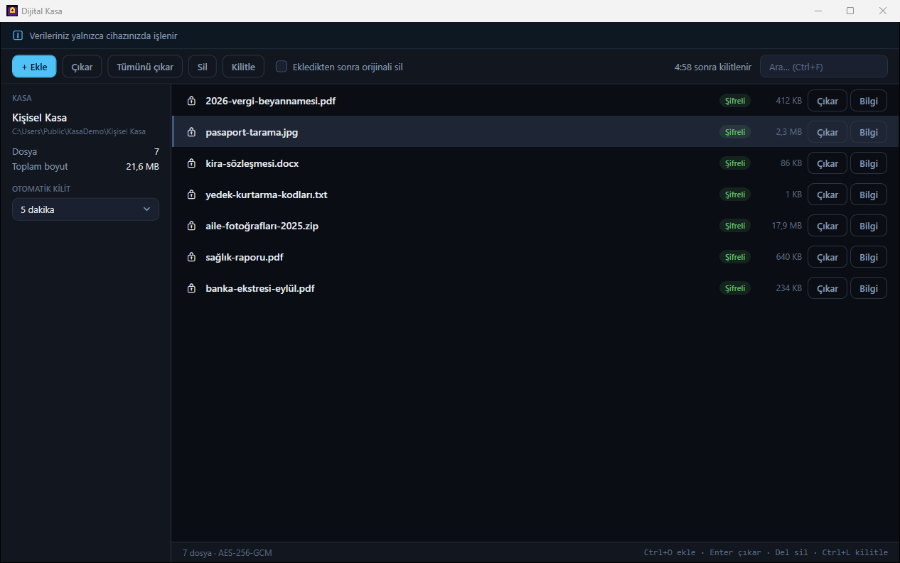
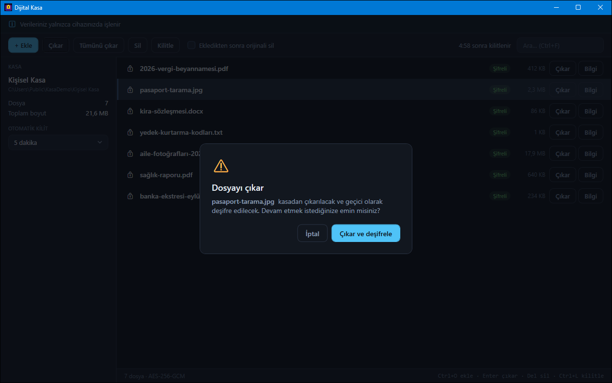

# Dosya Şifreleme ve Dijital Kasa

Dosyaları parola korumalı, yerel bir klasörde AES-256-GCM ile şifreleyerek saklayan Windows (WPF) kasası.



## Özellikler

**Şifreleme**
- Paroladan anahtar: Argon2id (64 MB, 4 iterasyon, 2 iş parçacığı); parola ve anahtar diske yazılmaz
- İçerik, dosya adı ve uzantı AES-256-GCM ile şifrelenir; her kayıtta yeni rastgele nonce
- Eklenen her dosya diske yazıldıktan sonra geri okunup deşifre edilerek orijinalle karşılaştırılır; doğrulanmayan kopya kasaya alınmaz
- Kasa biçimi ve KDF parametreleri sabittir (testle korunur): eski kasalar açılmaya devam eder

**Dosya işlemleri**
- Ekleme: `+ Ekle` / `Ctrl+O` (çoklu seçim) veya sürükle-bırak; şifreleme arka planda, pencere donmaz
- **Kasaya taşı:** "Ekledikten sonra orijinali sil" işaretliyse orijinal, şifreli kopya doğrulandıktan sonra sıfırlarla üzerine yazılıp silinir
- Çıkarma (deşifre): onay katmanı + Kaydet diyaloğu; yanlış anahtar/bozuk dosyada hedefe hiçbir şey yazılmaz
- **Tümünü çıkar:** tüm kasayı bir klasöre deşifre eder (yedek); aynı adlı dosyaların üzerine yazmaz (`ad (2).uzantı`)
- Dosya bilgisi, kalıcı silme (onaylı), Türkçe harf duyarsız arama ve "eşleşen dosya yok" durumu

**Güvenlik ve kullanım**
- `Ctrl+L` ile kilit; ayarlanabilir otomatik kilit (1/5/15/30 dk hareketsizlik), geri sayım ve kilit nedeni
- Son açılan kasa klasörü, son çıkarma klasörü ve kilit süresi hatırlanır (parola asla)
- Kasa konumu yazılabilir/yapıştırılabilir ya da `Seç` ile seçilir; tam yol doğrulaması
- Koyu tema, klavye ile tam kullanım, ekran okuyucu adları (UIA)
- Bulut/hesap yok, ağ erişimi yok

## Hızlı başlangıç

| Ne | Komut |
|---|---|
| Hazır exe | `dist\dosya-sifreleme-ve-dijital-kasa\DosyaSifreleme.exe` (kurulum/.NET gerekmez) |
| Kaynaktan derle + başlat | `.\run.ps1` (`-Release`, `-NoBuild`) |
| Birim testleri | `.\run.ps1 -Check` |
| Arayüz testleri (FlaUI) | `.\run.ps1 -UiTest` (pencere açar) |
| Exe üret | `.\publish.ps1` → `dist\dosya-sifreleme-ve-dijital-kasa\` |

Gereksinim (kaynaktan): Windows, .NET 10 SDK.

## Kullanım

1. İlk açılışta **Yeni Kasa Oluştur** modundasınız: kasa klasörünü seçin (ya da yolu yazın), en az 6 karakterlik bir parola girin (12+ önerilir), **Kasayı Oluştur ve Aç**.
2. Dosyaları sürükleyin ya da `+ Ekle` ile seçin. Orijinalin kalmasını istemiyorsanız önce "Ekledikten sonra orijinali sil" kutusunu işaretleyin.
3. Bir dosyayı geri almak için seçip **Çıkar** (ya da `Enter`) → onay → kaydedilecek yer. Tüm kasa için **Tümünü çıkar**.
4. İşiniz bitince **Kilitle** (`Ctrl+L`). Sonraki açılışta son kasa hazır gelir; yalnızca parolayı yazıp `Enter`.



| Kısayol | Eylem |
|---|---|
| `Enter` (giriş ekranı) | Kasayı aç / oluştur |
| `Ctrl+O` | Dosya ekle |
| `Ctrl+F` | Aramaya git |
| `Esc` | Aramayı temizle / çıkarma onayını kapat |
| `↓` (aramadayken) | Listeye geç |
| `Enter` (listede) | Seçili dosyayı çıkar |
| `Delete` | Seçili dosyayı sil (onaylı) |
| `Ctrl+L` | Kasayı kilitle |

## Veri ve gizlilik

- **Kasa:** sizin seçtiğiniz klasör.
  ```
  kasam/
  ├── vault.db        # tuz, doğrulama verisi ve şifreli dosya adları (SQLite)
  └── data/{id}.enc   # tuz(16) + nonce(12) + etiket(16) + şifreli içerik
  ```
- **Tercihler:** `%LOCALAPPDATA%\DosyaSifreleme\settings.json` — son kasa yolu, son çıkarma klasörü, kilit süresi. Parola/anahtar içermez.
- **Ortam değişkenleri:** `DOSYA_SIFRELEME_DATA_DIR` tercih klasörünü değiştirir (testler geçici klasör kullanır);
  `DOSYA_SIFRELEME_AUTOLOCK_SECONDS` otomatik kilit süresini saniye olarak geçersiz kılar (test kancası).
- **Ağ erişimi:** yok. Parola unutulursa kasa kurtarılamaz.

## Mimari / analiz

- **Yığın:** .NET 10 WPF, CommunityToolkit.Mvvm 8.4.2, Konscious.Security.Cryptography.Argon2 1.3.1,
  Microsoft.Data.Sqlite 10.0.12 + SQLitePCLRaw.bundle_e_sqlite3 3.0.5, `System.Security.Cryptography.AesGcm`.
  Testler: xunit.v3 4.0.1 (Microsoft Testing Platform) + FlaUI.UIA3 5.0.0.
- **Klasörler:**
  ```
  DosyaSifreleme/
  ├── Services/CryptographyService.cs   # Argon2id, AES-GCM dosya/metin, atomik deşifre
  ├── Services/VaultService.cs          # kasa oluştur/aç/kapat, ekle/taşı/çıkar/tümünü çıkar/sil
  ├── Services/AppSettings.cs           # settings.json (tercihler)
  ├── ViewModels/                       # Main (gezinme), Login, Dashboard
  ├── Views/                            # LoginView, DashboardView (+ kısayollar)
  └── MainWindow.xaml(.cs)              # görünüm değişimi, otomatik kilit sayacı, genel kısayollar
  DosyaSifreleme.Tests/                 # VaultTests (birim), UiTests (FlaUI)
  ```
- **Veri akışı:** Giriş → `VaultService.OpenVault` (Argon2id ile anahtar, "VERIFIED" belirteci GCM ile doğrulanır) →
  Pano. Ekleme: dosya belleğe okunur → şifreli `.enc` yazılır → geri okunup karşılaştırılır → SQLite kaydı. Çıkarma:
  bellekte deşifre + etiket doğrulaması → geçici dosya → `File.Move` (yarım düz metin kalmaz).
- **Tasarım kararları:** Kilitlemede anahtar `ZeroMemory` ile silinir; arka plan işleri anahtarın kopyasıyla çalışır, bu
  yüzden kilit sırasında süren ekleme/çıkarma bozulmaz. SQLite havuzlaması kapalı (kasa klasörü kilitli kalmaz).
  Diyaloglar ana pencereye bağlı açılır (uygulama ön planda değilken arkada kalmaz).

## Testler

- **Birim + duman (19):** `.\run.ps1 -Check` — şifreleme/deşifre gidiş-dönüş, yanlış parola, kurcalanmış veri, eski dosya
  düzeni, sabit KDF çıktısı, başarısız ekleme/taşımada artık kalmaması, tümünü çıkar (üzerine yazmama), ayarlar, açılış.
- **Arayüz (3, FlaUI/UIA3):** `.\run.ps1 -UiTest` — oluştur, doğrulama hataları, `Seç` klasör diyaloğu, parola gücü/göster,
  ekle (Aç diyaloğu), kasaya taşı, iptal, arama/boş durum, çıkar (Kaydet diyaloğu), tümünü çıkar, bilgi ve silme
  MessageBox'ları, otomatik kilit ayarı, kilit/yanlış parola/açma, yeniden başlatmada hatırlama, otomatik kilit, klavye
  kısayolları. Envanter: [docs/arayuz-testi.md](docs/arayuz-testi.md).

## Bilinen sınırlar ve yol haritası

- Dosyalar tamamen belleğe okunarak şifrelenir; çok büyük (2 GB üstü) dosyalar desteklenmez. Yol haritası: akışlı (parçalı) GCM.
- "Kasaya taşı" tek geçişte sıfırlarla üzerine yazar; SSD/kopyalayan dosya sistemlerinde eski blokların kalmadığı garanti edilemez.
- Parola değiştirme yok (tüm dosyaların yeniden şifrelenmesini gerektirir). Yol haritası: güvenli, kesintiye dayanıklı yeniden anahtarlama.
- Klasör hiyerarşisi yok; kasa düz bir dosya listesidir.
