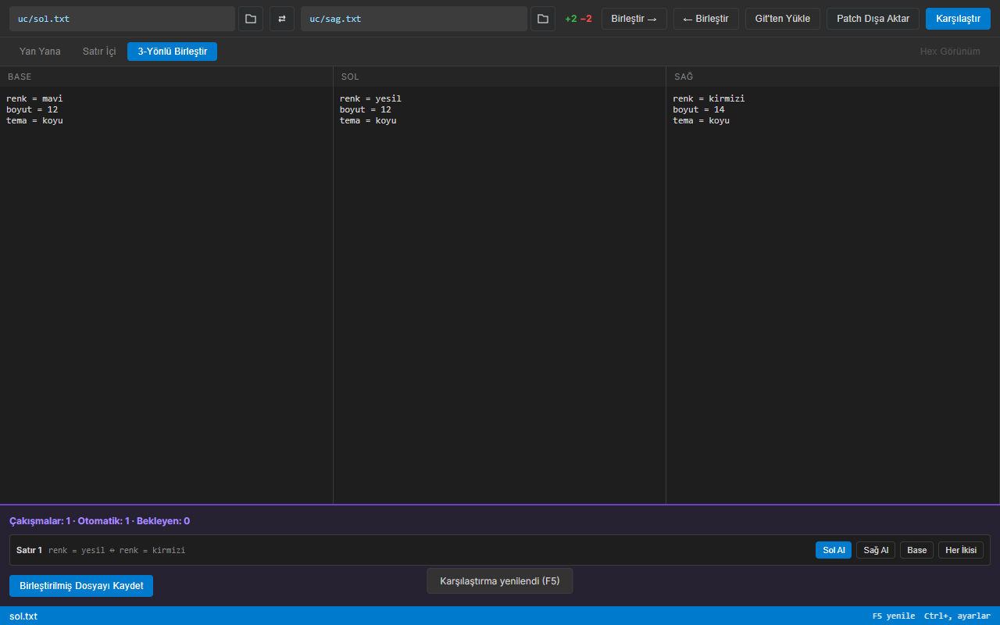

# Dosya ve Klasör Karşılaştırıcı

İki dosyayı veya klasörü yan yana karşılaştıran, farkları birleştiren ve patch üreten yerel Windows uygulaması (Meld / WinMerge alternatifi).


## Özellikler

- **Metin diff:** Monaco ile yan yana / satır içi görünüm, sözdizimi renklendirme, +/− satır özeti, önceki/sonraki farka atlama (Alt+↑ / Alt+↓).
- **Klasör karşılaştırma:** MD5 + mtime/boyut hash önbelleği, `.gitignore` ve özel filtre desenleri, dosya adı araması, "aynı dosyaları da göster", açılır/kapanır klasör ağacı, 8000 dosya sınırı uyarısı.
- **Birleştirme:** tek yönlü kopyalama (hedefe otomatik `.bak`), tek tarafta olan veya binary dosyaları da kopyalama; base + sol + sağ ile basit 3 yönlü birleştirme (satır bazlı çakışma seçimi).
- **Binary:** ilk 256 KB için hex görünüm (binary dosyada otomatik).
- **Patch:** unified patch dışa aktarma, yapıştırılan `git diff` çıktısını içe aktarma (çok dosyada gezinme).
- **Kullanım kolaylığı:** yolları yazma/yapıştırma veya gözat, sürükle-bırak, son karşılaştırılan çiftler, koyu/açık tema, klavye kısayolları.



## Hızlı başlangıç

| Ne | Komut |
|---|---|
| Hazır exe | `dist\dosya-ve-klasor-karsilastirici\Dosya Karsilastirici.exe` (repo kökünde; Node/Electron gerekmez) |
| Kaynaktan çalıştır | `.\run.ps1` (gerekirse `npm install` + Electron ikilisi; Vite **5171** portu) |
| Tip + birim testleri + derleme | `.\run.ps1 -Check` |
| Arayüz testleri (pencere açar) | `.\run.ps1 -UiTest` |
| Exe üretme | `.\publish.ps1` → `dist\dosya-ve-klasor-karsilastirici\` |

Gereksinim (kaynaktan): Node.js 22.12+ ve Windows 10/11.

## Kullanım

1. Sol ve sağ yolu yazın/yapıştırın, klasör ikonuyla seçin ya da karşılama ekranına sürükleyin.
2. **Karşılaştır** (F5 veya yol kutusunda Enter). İki dosya → doğrudan diff; iki klasör → solda fark ağacı.
3. Ağaçta dosyaya tıklayın; **Birleştir →** / **← Birleştir** ile kopyalayın (hedefin `.bak` yedeği alınır).
4. 3 yönlü birleştirme için Ayarlar > Diff > **Base yolu** girin, **3-Yönlü Birleştir** sekmesinde çakışmaları çözüp kaydedin.
5. **Patch Dışa Aktar** ile `.patch` yazın; **Git'ten Yükle** ile `git diff` çıktısını görüntüleyin.

| Kısayol | İşlev |
|---|---|
| F5 / Enter (yol kutusunda) | Karşılaştır |
| Alt+↓ / Alt+↑ | Sonraki / önceki fark |
| F1 | Yardım |
| Ctrl+, | Ayarlar |
| Esc | Açık diyaloğu kapat |
| Ctrl+F (editörde) | Monaco arama |

## Veri ve gizlilik

- Ayarlar ve son çiftler: `%LocalAppData%\DosyaKarsilastirici\settings.json`; hash önbelleği: aynı klasörde `hash-cache\`. Ayarlar > Genel > **Önbelleği temizle** önbelleği siler.
- Konum `LOCALAPPDATA` ortam değişkeniyle değiştirilebilir (testler bunu geçici klasöre yönlendirir; `APPDATA` Electron'un kendi profilidir).
- Ağ erişimi yok: Monaco yerel paketten yüklenir, harici font/CDN kullanılmaz. Dosyalar yalnızca birleştirme/kaydetme komutlarında yazılır.

## Mimari / analiz

- **Yığın:** Electron 44, React 19, Vite 8 (Rolldown) + vite-plugin-electron 1, @vitejs/plugin-react 6, TypeScript 7, Monaco Editor 0.57 (@monaco-editor/react 4.7), jsdiff 9, Vitest 5, Playwright 1.63, electron-builder 26 + rcedit.
- **Klasörler:**
  ```
  electron/   ana süreç: main.ts (IPC + pencere), compareLogic (tarama, hash, birleştirme),
              hashCache, gitignoreParser, patchLogic, threeWayMerge, hexLogic, settingsStore, preload
  src/        React arayüzü: App.tsx (durum), components/ (Toolbar, FolderTree, DiffPane, ThreeWayPane,
              HexPane, ViewTabs, Settings/Help/GitDiff diyalogları), hooks/useKeyboard, styles/app.css
  tests/      Vitest birim testleri (ana süreç mantığı)
  e2e/        Playwright _electron arayüz testleri + README görüntü üretici
  docs/       ekran görüntüleri, arayuz-testi.md
  ```
- **Veri akışı:** React → `window.electronAPI` (preload, contextIsolation) → `ipcMain.handle` → saf mantık modülleri → JSON sonuç. Klasör taraması ilerlemeyi `compare:progress` olayıyla bildirir.
- **Tasarım kararları:** karşılaştırma ve birleştirme mantığı Electron'dan bağımsız modüllerde (birim testlenebilir); hash önbelleği kök başına ayrı JSON; tema CSS değişkenleriyle (`html[data-theme]`) ve Monaco `vs`/`vs-dark`; `signAndEditExecutable: false` (Geliştirici Modu gerektirmesin) + rcedit ile exe ikonu/sürüm bilgisi.

## Testler

| Tür | Sayı | Komut |
|---|---|---|
| Birim (Vitest) | 21 | `npm test` / `.\run.ps1 -Check` |
| Arayüz / e2e (Playwright `_electron`) | 3 senaryo, ~120 doğrulama | `.\run.ps1 -UiTest` |
| README görüntüleri | 1 (varsayılan atlanır) | `$env:DK_SCREENSHOTS=1; npx playwright test screenshots` |

Kontrol envanteri: [docs/arayuz-testi.md](docs/arayuz-testi.md).

## Bilinen sınırlar ve yol haritası

- 3 yönlü birleştirme satır bazlıdır (satır ekleme/silme kaymalarını hizalamaz); metin 4 MB, hex 256 KB ile sınırlı.
- Klasör taraması 8000 dosyada durur; büyük ağaçlarda alt klasör seçin.
- İşletim sisteminden gerçek dosya sürükle-bırak otomatik testle doğrulanmıyor (yalnızca bırakma bölgesi olayları test edilir).
- Paket boyutu ~380 MB (Electron 44 çalışma zamanı).
- Yol haritası: satır içi düzenleme ve kaydetme, satır/blok bazlı kısmi birleştirme, sistem temasını izleme.
