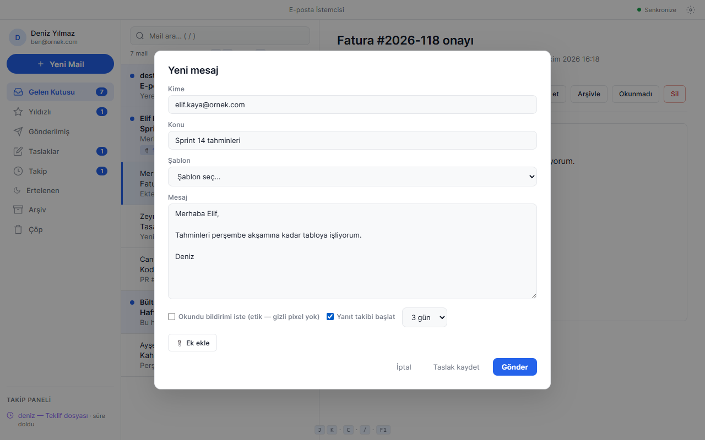
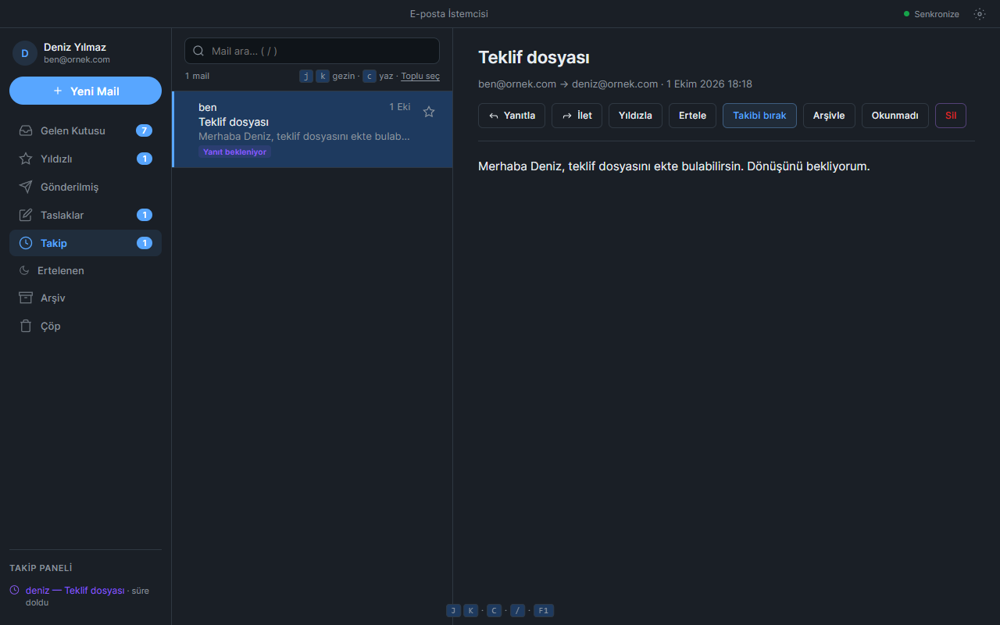

# E-posta İstemcisi ve Takip Aracı

IMAP/SMTP hesaplarını yerel SQLite önbelleğiyle yöneten, yanıt takibi ve erteleme özellikleri cihazda çalışan Electron e-posta istemcisi.


## Özellikler

- **Hesaplar:** çoklu IMAP/SMTP hesabı (Gmail/Outlook profili veya özel sunucu + port), Gmail için uygulama şifresi veya OAuth, birleşik gelen kutusu, "Bağlantıyı test et" (IMAP + SMTP, mesaj göndermeden)
- **Posta:** gelen (son 150 mesaj), gönderilmiş, taslaklar, yıldızlı, arşiv, çöp; arama; toplu işlemler; dosya eki; HTML mail korumalı iframe'de (uzak görsel / izleme pikseli yüklenmez)
- **Takip:** yanıt takibi (3/5/7 gün, süre dolunca bildirim; aynı konulu yanıt gelince otomatik kapanır), erteleme (bu akşam, yarın, gelecek hafta, özel tarih) ve **Ertelenen** klasörü
- **Güvenli geri dönüş:** silme / arşivleme / erteleme / toplu işlemler için **Geri al** (Ctrl+Z); arşiv, çöp ve ertelenenlerden gelen kutusuna taşıma; çöpü boşaltma onaylı
- **Yazma:** şablonlar (`{ad}`, `{konu}`), etik okundu bildirimi (gizli piksel yok), Ctrl+Enter ile gönder; yazılan mail Esc ile kaybolmaz, taslağa kaydedilir
- **Uygulama:** açık/koyu/sistem teması, JSON yedek dışa/içe aktarma (birleştirir), arka plan senkronu, IMAP IDLE, sistem tepsisi, klavye kısayolları

## Hızlı başlangıç

| Ne | Komut |
|---|---|
| Hazır exe | `dist\e-posta-istemcisi-ve-takip-araci\EpostaIstemcisi.exe` (kurulum gerektirmez) |
| Kaynaktan çalıştır | `.\run.ps1` (bağımlılıkları gerekirse kurar, Vite **5172** + Electron) |
| Tip kontrolü + birim testleri + derleme | `.\run.ps1 -Check` |
| Arayüz + e2e testleri (pencere açar) | `.\run.ps1 -UiTest` |
| Exe üret | `.\publish.ps1` → `dist\e-posta-istemcisi-ve-takip-araci\` |
| Kurulum paketi (NSIS) | `npm run pack` → `release\` |

Gereksinim (kaynaktan): Node.js 22.12+. Port 5172 doluysa `run.ps1` açıklayıcı bir hata verir.

İlk kurulum: Ayarlar → Gmail/Outlook profili → e-posta ve şifre (veya OAuth Client ID) → Bağlantıyı test et → Kaydet → Senkronize.

## Kullanım

Bir maili seçip okuyucudaki düğmelerle yanıtlayın, iletin, erteleyin, takibe alın, arşivleyin veya silin; her geri alınabilir işlemden sonra sağ altta **Geri al** görünür. Takip paneli (sol alt) yanıt beklenen mailleri ve kalan gün sayısını gösterir. Pencere daraldığında (veya %150 yakınlaştırmada) liste kompakt klasör seçicisine ve kaplama okuyucuya geçer.

| Kısayol | İşlev |
|---|---|
| `j` / `k` | Sonraki / önceki mail |
| `Enter` | Maili aç |
| `c` | Yeni mail |
| `r` / `f` | Yanıtla / İlet |
| `e` | Arşivle |
| `u` | Okunmadı işaretle |
| `#` | Sil |
| `s` | Yıldızla |
| `/` | Aramaya odaklan |
| `Ctrl+Z` | Son silme / arşivleme / ertelemeyi geri al |
| `Ctrl+Enter` | Yazılan maili gönder |
| `Esc` | Pencereyi kapat (yeni mailde değişiklik varsa taslağa kaydeder) |
| `F1` | Kısayol yardımı |

## Veri ve gizlilik

- Veri klasörü: Electron `userData` (`%APPDATA%\e-posta-istemcisi-ve-takip-araci\`): `mailbox.db` (SQLite önbellek), `settings.json`, `accounts.json`, `templates.json`, `credentials.json`.
- `EPOSTA_DATA_DIR` ortam değişkeni veri klasörünü değiştirir (testler ve taşınabilir kullanım için).
- Şifre ve OAuth token'ları `safeStorage` (Windows DPAPI) ile şifrelenir; OS şifrelemesi yoksa düz metne düşülmez, kaydetme reddedilir. Kayıtlı şifre arayüze geri gönderilmez.
- Ağ erişimi yalnızca yapılandırdığınız IMAP/SMTP sunucularına ve (seçerseniz) Google OAuth'a yapılır. Arayüz harici yazı tipi veya içerik yüklemez; HTML maillerdeki uzak görseller CSP ile engellenir.
- Önbellek süresi yalnızca sunucudan gelen gelen-kutusu kopyalarına uygulanır; gönderilenler, taslaklar, yıldızlı ve takipteki mesajlar silinmez.

## Mimari / analiz

**Yığın:** Electron 44.5, React 19.3, Vite 8.3 (vite-plugin-electron 1.1, @vitejs/plugin-react 6), TypeScript 7, better-sqlite3 13 (N-API), imapflow 2.2, nodemailer 10, mailparser 3.9, @tanstack/react-virtual; testler Vitest 5 + Playwright 1.63 `_electron`; paketleme electron-builder 26 + rcedit.

```
electron/        ana süreç
  main.ts        pencere, tepsi, tema, IPC uçları
  store.ts       ayarlar/şablon JSON'ları + mesaj işlemleri (klasör, takip, erteleme, yedek)
  db.ts          SQLite şeması ve sorgular (WAL)
  mailLogic.ts   saf mantık: klasör eşleme, arama, önbellek budama, yanıt eşleme (birim testli)
  imapService.ts / idleService.ts / syncWorker.ts   IMAP senkronu, IDLE, zamanlayıcı
  smtpService.ts gönderim + bağlantı doğrulama
  accounts.ts / secretStore.ts / oauthGmail.ts      hesaplar, DPAPI şifreleme, OAuth PKCE
  preload.ts     contextBridge API'si (window.electronAPI)
src/             React arayüzü (App.tsx durum + kısayollar, components/, ortak Modal)
test/            Vitest (sahte SMTP sunucusu, sahte imapflow, sahte safeStorage)
e2e/             Playwright Electron: ui.spec.ts (arayüz envanteri), app.spec.ts (hesap + SMTP), screenshots.spec.ts
```

**Veri akışı:** IMAP → `syncWorker` → `mergeInboxForAccount` (yerel bayraklar korunur, yanıt gelen takipler kapanır) → SQLite → IPC `mail:list` → React listesi (sanal kaydırma). Gönderim: arayüz → `mail:send` → nodemailer → "Gönderilmiş" kaydı (+ isteğe bağlı takip).

**Tasarım kararları:**
- better-sqlite3 13 N-API hazır ikili ile gelir; Node (vitest) ve her Electron sürümü aynı ikiliyi kullanır, `electron-rebuild` / derleyici gerekmez. Paket yalnızca `win32-x64` ikilisini içerir.
- Ana süreç tek dosyaya paketlenir (yalnızca better-sqlite3 harici); exe'ye `node_modules` kopyalanmaz.
- Geri al, işlem öncesindeki mesaj kopyalarını doğrulayıp (`sanitizeImportedMessages`) geri yazar; ayrı bir geçmiş tablosu yoktur.
- Tema `nativeTheme.themeSource` ile uygulanır; CSS `prefers-color-scheme` değişkenleri bunu izler.

## Testler

| Tür | Sayı | Komut |
|---|---|---|
| Birim (Vitest) | 30 | `npm test` |
| Arayüz (Playwright `_electron`) | 4 | `npx playwright test ui` |
| E2E: hesap kurulumu, şifrenin düz metin yazılmadığı, sahte SMTP ile gönderim | 1 | `npx playwright test app` |
| README ekran görüntüleri | 1 (varsayılan atlanır) | `$env:MAIL_SCREENSHOTS=1; npx playwright test screenshots` |

Gerçek hesap kullanılmaz; her UI testi geçici veri klasörüyle açılır ve kurgusal örnek posta kutusunu "İçe aktar" düğmesiyle yükler. Kontrol envanteri: [docs/arayuz-testi.md](docs/arayuz-testi.md).

## Bilinen sınırlar ve yol haritası

- IMAP yalnızca gelen kutusunun son 150 mesajını çeker; sunucu klasörleri (Gönderilmiş, Arşiv) eşlenmez, arşiv/çöp/erteleme yereldir.
- Çöpten geri yüklenen mail özgün klasörünü bilmez: sunucudan gelen → Gelen Kutusu, yerel → Gönderilmiş.
- Gelen maillerin ekleri listelenir ama indirilemez.
- Google OAuth akışı (gerçek Google hesabı gerektirdiği için) otomatik testte yalnızca doğrulama hatasıyla denenir.
- Yol haritası: sunucu klasörü eşleme, ek indirme, çoklu pencere / sekmeli okuma.



