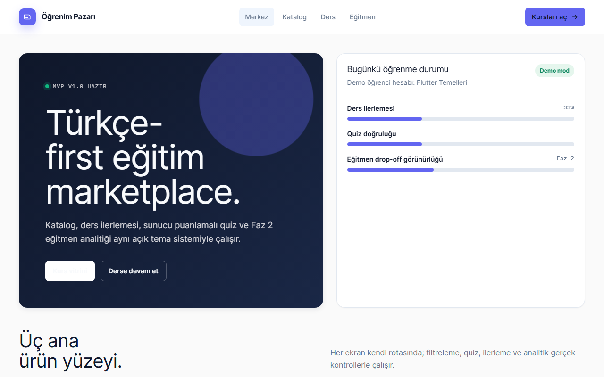

# Öğrenim Pazarı

Kurs kataloğu, ders ilerlemesi ve sunucuda puanlanan quiz içeren, yerelde çalışan Next.js + SQLite eğitim platformu.



## Özellikler

**Öğrenci**
- `/katalog`: arama (başlık + açıklama, Türkçe harf duyarsız), seviye ve kategori filtresi, boş sonuç durumu
- `/course/[id]`: müfredat kenar çubuğu, ders tamamlama, ilerleme yüzdesi, ilerlemeyi sıfırla (quiz geçmişi korunur)
- Quiz: tüm dersler bitince açılır (kilit sunucuda da uygulanır); doğru cevaplar istemciye gönderilmez,
  puanlama sunucuda; sonuçta yalnızca yanlış seçilen şıklar "Yanlış" olarak işaretlenir
- Quiz geçmişi: son 5 deneme ve en iyi sonuç
- `/ders`: son kursa kısayol

**Eğitmen (prototip, veri kaydetmez)**
- `/egitmen`: drop-off grafiği (Seed / 7 gün / 30 gün), taslağa modül ekle/kaldır, yayın kontrol listesi

İlk açılışta demo kurs otomatik oluşturulur (Flutter Temelleri: 3 ders + 3 soru). Kimlik doğrulama, ödeme ve
gerçek video oynatıcı yoktur.

## Hızlı başlangıç

| Ne | Komut |
|---|---|
| Hazır exe | `dist\egitim-ve-ogrenme-platformu\OgrenimPazari.exe` (Node gerekmez) |
| Kaynaktan çalıştır | `.\run.ps1` → http://localhost:3101 |
| Testler | `.\run.ps1 -Check` (vitest + tsc + Playwright e2e) |
| Exe üret | `.\publish.ps1` → `dist\egitim-ve-ogrenme-platformu\` (sonunda paketli exe'yi test eder) |

Elle: `npm install`, `npm run db:push`, `npm run dev`. Üretim: `npm run build` + `npm start`.
Gereksinim (kaynaktan): Node.js 22.5+.

## Kullanım

1. **Merkez**'den **Kurs vitrini**'ne geçin, kursu arayın/filtreleyin, **Devam et** ile açın.
2. Dersi seçin, **Dersi tamamla**'ya basın; üç ders bitince **Quiz'e geç**.
3. Tüm soruları yanıtlayıp **Cevabı gönder**; sonuç ve geçmiş altta görünür.
4. Baştan almak için kenar çubuğunda **İlerlemeyi sıfırla** (onay ister).

| Kısayol | İşlev |
|---|---|
| Tab (sayfa başında) | "İçeriğe atla" bağlantısı |
| Enter (modül kutusunda) | Eğitmen taslağına modül ekle |

## Veri ve gizlilik

- Veriler yerel SQLite'ta: kaynaktan `prisma\dev.db`, exe'de `%APPDATA%\Ogrenim Pazari\ogrenim.db`
  (ilk açılışta boş şablondan kopyalanır, mevcut veri ezilmez).
- Ağ erişimi yok; tüm istekler yerel sunucuya gider. Telemetri yok.
- Ortam değişkenleri: `DATABASE_URL` (veritabanı dosyası), `APP_DATA_DIR` (exe veri klasörü; testler geçici
  klasör verir), `DESKTOP_EXE` (Electron testinde paketli exe yolu).

## Mimari / analiz

| Katman | Teknoloji |
|---|---|
| UI | Next.js 16.3 (App Router), React 19.3, Tailwind CSS 4.3 |
| Veri | Prisma 6.19 + SQLite (`Course`, `Lesson`, `Progress`, `Quiz`, `QuizAttempt`) |
| Masaüstü | Electron kabuğu (`desktop/main.cjs`) + Next standalone sunucu, electron-builder |
| Test | Vitest 3, Playwright 1.63 (web + `_electron`), TypeScript 6 |

```
prisma/schema.prisma   Course, Lesson, Progress, Quiz, QuizAttempt
src/app/               sayfalar (/, katalog, ders, course/[id], egitmen) ve API route'ları
src/components/        SiteHeader, CatalogClient, QuizPanel, CourseCover, Button
src/lib/               Prisma istemcisi, demo seed, quiz puanlama/doğrulama, statik katalog
scripts/create-db.mjs  şemadan boş SQLite (testler + exe şablon db)
desktop/main.cjs       Electron kabuğu (standalone server.js'i alt süreç olarak başlatır)
tests/                 vitest; e2e/ (Playwright); electron/ (paketli exe)
```

Veri akışı: sunucu sayfaları (`/`, `/katalog`) Prisma'dan doğrudan okur (`force-dynamic`); kurs sayfası istemci
bileşenidir ve `/api/courses/[id]`, `/api/lessons/[id]/complete`, `/api/courses/[id]/quiz/submit`,
`/api/courses/[id]/reset` uçlarını kullanır. Quiz'in doğru şıkları yalnızca sunucuda; gönderimde ders kilidi,
cevap sayısı ve aralığı denetlenir. `ensureSeed` eşzamanlı ilk isteklerde bile tek demo kurs bırakır.

## Testler

| Tür | Sayı | Komut |
|---|---|---|
| Birim + API (vitest, ayrı `test-results/vitest.db`) | 10 | `npm test` |
| Web e2e (Playwright, port 3201, `prisma/e2e.db`) | 4 | `npm run test:e2e` |
| Paketli exe (Playwright `_electron`, geçici veri klasörü) | 1 | `publish.ps1` sonunda otomatik |

## Bilinen sınırlar ve yol haritası

- Ayrıntılı arayüz testi (her kontrol) bu turda tamamlanmadı; elle test edilecek.
- Eğitmen paneli ve katalogdaki diğer kurslar statik prototip; tek demo öğrenci, hesap/ödeme/video yok.
- Exe ~490 MB (Electron + Next standalone).
