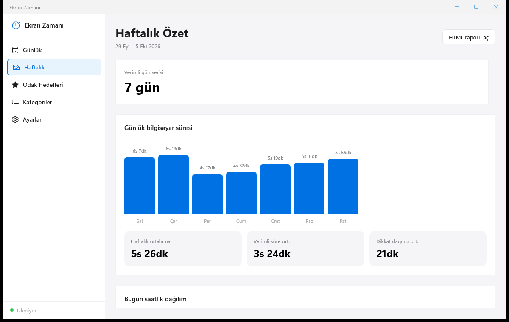

# Ekran Zamanı

Hangi uygulamada ne kadar vakit geçirdiğinizi ölçen, kategorilere ayıran ve yerelde saklayan WinUI 3 uygulaması.



## Özellikler

- Ön plandaki uygulamayı saniyede bir izler, boşta kalmayı algılar (eşik ayarlanabilir); eşik dolunca boşta geçen süre geriye dönük silinir
- Kilit ekranı (Win+L) anında, uyku/hazırda bekleme süresi hiç sayılmaz; gece yarısını aşan kayıtlar günlere bölünür
- **Günlük** özet (gün gün gezinme, toplam süre, zaman çizelgesi, en çok kullanılan uygulamalar, kategori dağılımı, web siteleri), **Haftalık** özet (günlük süre grafiği, haftalık ortalamalar, verimli gün serisi, saatlik dağılım, HTML rapor)
- Kategoriler: Verimli / İletişim / Nötr / Dikkat dağıtıcı; kural tabanlı (desen → kategori), son 7 güne göre otomatik kural önerileri, varsayılan kuralları yükleme
- **Odak hedefleri** (desen + hedef dakika, tamamlanınca bildirim), dikkat dağıtıcı süre uyarısı (varsayılan 120 dk), günlük özet bildirimi, tepsi bildirimleri
- Gizlenecek uygulama listesi (kara liste); parola yöneticileri varsayılan olarak hiç kaydedilmez, banka vb. pencere başlıkları boşaltılır
- Veri saklama süresi (Ayarlar > İzleme): N günden eski kayıtlar otomatik silinir (0 = süresiz)
- CSV/JSON dışa aktarma, ActivityWatch içe/dışa aktarma, zip yedekleme ve geri yükleme, "tüm verileri sil"
- Sistem tepsisi (izlemeyi duraklat / aç / çıkış) + `Ctrl+Shift+E` global kısayolu; tema `settings.json` içindeki `Theme` değeriyle (`light` / `dark`) seçilir (ayarlar sayfasında seçici yoktur)
- İsteğe bağlı tarayıcı eklentisi (`browser-extension/`): site bazlı süre; isteğe bağlı Pomodoro durum köprüsü, haftalık e-posta raporu (SMTP) ve self-host sync API (varsayılan kapalı)

## Hızlı başlangıç

```powershell
..\dist\ekran-zamani-ve-uygulama-kullanim-takibi\EkranZamani.WinUI.exe   # hazır exe (.NET / Windows App Runtime gerekmez)

.\run.ps1             # ikonları üretir, x64 Debug derler ve açar (-Release, -NoBuild var)
.\run.ps1 -Check      # testleri çalıştırır
.\publish.ps1         # self-contained klasör çıktısı → ..\dist\ekran-zamani-ve-uygulama-kullanim-takibi\
```

`run.ps1` paketsiz (Windows App SDK gömülü; Geliştirici Modu gerekmez) derler, kaynak değişmediyse derlemeyi atlar ve **açık bir EkranZamani.WinUI kopyasını önce kapatır** (aynı anda iki takipçi çalışmaz). Pencereyi kapatınca uygulama tepside çalışmaya devam eder; çıkmak için tepsi menüsünden **Çıkış**.

Gereksinimler: Windows 10/11 x64; geliştirme için .NET 10 SDK (exe için gerekmez).

## Kullanım

Sol menüden **Günlük**, **Haftalık**, **Odak Hedefleri**, **Kategoriler** ve **Ayarlar** sayfalarına geçilir; sol altta izleme durumu görünür. Günlük sayfada ok düğmeleriyle önceki günlere bakılır, **Dışa Aktar** menüsü CSV veya JSON dışa aktarır; Haftalık sayfada **HTML raporu aç** ile haftalık rapor üretilir.

| Kısayol / işlem | İşlev |
|---|---|
| Ctrl+Shift+E | Global kısayol (Ayarlar'dan kapatılabilir) |
| Tepsi simgesi > İzlemeyi duraklat | İzlemeyi durdur / başlat |
| Tepsi simgesi > Dashboard'u aç | Pencereyi göster |
| Tepsi simgesi > Çıkış | Uygulamayı kapat |
| Pencereyi kapatma | Tepsiye küçültür (Ayarlar'dan değiştirilebilir) |

Tarayıcı eklentisi kurulumu: Chrome/Edge → `chrome://extensions` → Geliştirici modu → **Paketlenmemiş öğe yükle** → `browser-extension` klasörü (ayrıntı: `browser-extension/README.md`).

## Veri ve gizlilik

- Tüm veriler yalnızca bu bilgisayarda tutulur: `%LocalAppData%\EkranZamani\` (`usage.db`, `settings.json`; köprü/sync dosyaları için `bridge\`, `sync\`). `EKRANZAMANI_DATA_DIR` ortam değişkeni ile değiştirilebilir (testler geçici klasör kullanır).
- Ağ: yerel köprü (varsayılan `127.0.0.1:47123`, tarayıcı eklentisi için) ve isteğe bağlı sync API (`127.0.0.1:47124`, varsayılan kapalı) yalnızca `127.0.0.1` dinler; `Origin` başlığı eklenti kökenli (`chrome-extension://`, `moz-extension://`) değilse isteği reddeder, böylece web siteleri yazamaz. Sync API'de ayrıca kimlik doğrulama yoktur.
- Dışarıya tek çıkış, siz yapılandırırsanız haftalık e-posta raporudur (SMTP); SMTP parolası `settings.json`'a Windows DPAPI ile şifreli yazılır. Telemetri yoktur.
- Pencere başlığı kaydı Ayarlar'dan kapatılabilir; "Windows ile başlat" yalnızca `HKCU` Run anahtarına yazar (`RunAtStartup` kapalıyken uygulama açılışta bu girdiyi siler).

## Mimari ve analiz

- **Teknoloji:** WinUI 3 / Windows App SDK 2.1.3 (`net10.0-windows10.0.26100.0`, paketsiz, self-contained), CommunityToolkit.Mvvm 8.4.2; çekirdek kütüphane `net10.0-windows`: Microsoft.Data.Sqlite 10.0.12 + SQLitePCLRaw.lib.e_sqlite3 2.1.13, System.Security.Cryptography.ProtectedData. Test: xunit. Sürüm 1.0.0; tarayıcı eklentisi 1.1.0 (Manifest V3).

```
EkranZamani.Core/            İzleme, SQLite, kategori, rapor, yerel HTTP köprüsü (UI'dan bağımsız)
  Services/                  TrackingService, DatabaseService, TimelineBuilder, CategoryService,
                             FocusGoalService, BridgeHostService, SyncApiHostService, Backup/Export/
                             ActivityWatch/WeeklyReport/WeeklyEmail/DailySummary, SensitiveAppFilter...
  Models/ Helpers/           AppSettings, AppUsage, TimelineSegment, Win32Api...
windows/EkranZamani.WinUI/   WinUI 3 arayüz: MainWindow, ShellPage, Daily/Weekly/Goals/Categories/Settings
                             sayfaları + ViewModels, tepsi (Win32 Shell_NotifyIcon), global kısayol
EkranZamani.Tests/           xunit testleri
browser-extension/           Chromium MV3 eklentisi (127.0.0.1:47123'e site süresi gönderir)
shared/schema.sql            Veritabanı şeması
```

**Veri akışı:** `TrackingService` saniyede bir ön plan penceresini (Win32) okur → oturum değişince/30 sn'de bir `DatabaseService` ile `WindowUsage` tablosuna yazar (gece yarısında bölünür) → ViewModel'ler `TimelineBuilder`, kategori ve rapor servisleriyle günlük/haftalık görünümü üretir. Tarayıcı eklentisi `POST /api/web-usage` ile `WebDomainUsage` tablosuna yazar. `AppServices` dakikada bir hedef/uyarı/özet/yedekleme işlerini ve veri temizlemeyi tetikler.

**Tasarım kararları:** çekirdek mantık UI'dan ayrıdır ve testlerde geçici veri klasörüyle çalışır; yerel API'ler yalnızca loopback + Origin denetimiyle açılır; tek örnek `Global\EkranZamani_App_v1` mutex'i ile sağlanır (ikinci başlatma mevcut pencereyi öne getirir); WinUI uygulaması tek dosyaya sığmadığı için klasör çıktısıdır (`PublishTrimmed` kapalı).

## Testler

`EkranZamani.Tests` altında 31 xunit test metodu (4 `Theory`, toplam 45 durum): izleme doğruluğu (boşta, uyku, gece yarısı bölme), zaman çizelgesi, kategori ve öneri servisleri, odak hedefleri, gizlilik filtresi ve köprü Origin denetimi, ActivityWatch / sync dışa-içe aktarma, haftalık e-posta, verimli gün serisi, süreç görünen adları.

```powershell
.\run.ps1 -Check
# veya
dotnet test EkranZamani.Tests/EkranZamani.Tests.csproj
```

## Bilinen sınırlar

- Yalnızca Windows 10/11 x64; ağır WinUI çıktısı (yüzlerce dosya) olduğundan tek exe değildir.
- Günlük zaman çizelgesi 960 px sabit iz genişliğine göre konumlanır; pencere çok daralırsa parçalar sağa taşabilir.
- Pencere yeniden boyutlandırıldığında içerik genişlikleri sabit değerlere bağlı kalabilir (varsayılan pencere 1200×760).
- Sync API kimlik doğrulaması içermez; yalnızca loopback ve Origin denetimi vardır.
- Banka/parola yöneticisi filtresi sabit bir anahtar kelime listesine dayanır; diğer hassas uygulamalar kara listeye elle eklenmelidir.
