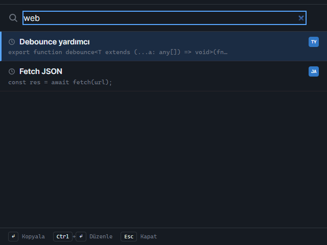

# Kod Parçası Snippet Yöneticisi

Kod parçalarınızı yerelde saklayan, **Alt+Shift+S** arama paletiyle her uygulamanın üstünden aranıp kopyalanabilen Electron masaüstü uygulaması.


## Özellikler

- **Kütüphane:** snippet ekle / düzenle / çoğalt / sil (başlık, açıklama, dil, etiket, klasör); silme onay ister, kaydedilmemiş değişiklik varken başka snippete geçmeden önce sorulur.
- **Bulma:** anlık arama (başlık, açıklama, kod, dil, klasör, etiket; Türkçe harf duyarsız), klasör ve etiket filtreleri, klavyeyle liste gezinme.
- **Arama paleti:** global **Alt+Shift+S** veya araç çubuğundaki **Palet** düğmesi; boş sorguda son kullanılanlar, Enter kopyalar, Ctrl+Enter düzenler, sonuç yoksa sorgu adıyla yeni snippet. Kısayol başka uygulamada kayıtlıysa araç çubuğunda ⚠ uyarısı.
- **Yer tutucular** (kopyalarken genişler): `{{date}}`, `{{time}}`, `{{datetime}}`, `{{user}}`, `{{hostname}}`, `{{year}}`.
- **Taşıma:** JSON içe aktarma (dosya seç, sürükle-bırak veya diyalog; önizleme özeti, var olan id'ler atlanır) ve dışa aktarma.
- Tek örnek: ikinci açılış mevcut pencereyi öne getirir.



## Hızlı başlangıç

| Ne | Komut |
|---|---|
| Hazır exe | `dist\kod-parcasi-snippet-yoneticisi\kod-parcasi-snippet-yoneticisi.exe` (repo kökünde; Node/Electron gerekmez) |
| Kaynaktan çalıştır | `.\run.ps1` (gerekirse `npm install` + Electron ikilisi; Vite **5173** portu) |
| Tip + birim testleri + derleme | `.\run.ps1 -Check` |
| Arayüz testleri (pencere açar) | `.\run.ps1 -UiTest` |
| Exe üretme | `.\publish.ps1` → `dist\kod-parcasi-snippet-yoneticisi\` |

Gereksinim (kaynaktan): Node.js 22.12+ ve Windows 10/11.

## Kullanım

1. **Yeni snippet** (Ctrl+N) → başlık, etiketler (`#js, #util`), dil, klasör, açıklama ve kodu girin → **Kaydet** (Ctrl+S).
2. Listeden seçip **Kopyala**; yer tutucular o anki değerlerle panoya yazılır.
3. Başka bir uygulamadayken **Alt+Shift+S** → yazın → Enter ile kopyalayın.
4. **Import / Export** (Ctrl+E) ile kütüphaneyi JSON olarak taşıyın.

| Kısayol | İşlev |
|---|---|
| Alt+Shift+S (global) | Arama paletini aç |
| Ctrl+N | Yeni snippet |
| Ctrl+S | Kaydet |
| Ctrl+F | Aramaya odaklan |
| Ctrl+E | Import / Export |
| ↑ / ↓ / Home / End (listede) | Snippet seç |
| Esc | Modalı / paleti kapat |
| Palette: Enter / Ctrl+Enter | Kopyala / ana pencerede düzenle |

## Veri ve gizlilik

- Tüm snippet'ler tek dosyada: `%AppData%\kod-parcasi-snippet-yoneticisi\snippets.json` (klasör adı sürümler arasında sabit).
- Yazma geçici dosya + yeniden adlandırma ile yapılır. Dosya bozulursa silinmez; `snippets.corrupt-<zaman>.json` olarak kenara alınır ve uygulama boş kütüphaneyle açılır.
- Konum Electron'un `--user-data-dir=<klasör>` anahtarıyla değiştirilebilir (testler bunu kullanır).
- Ağ erişimi yok; harici font/CDN yüklenmez. Pano yalnızca Kopyala komutunda yazılır.

## Mimari / analiz

- **Yığın:** Electron 44, React 19, Vite 8 (Rolldown) + vite-plugin-electron 1, @vitejs/plugin-react 6, TypeScript 7, Vitest 5, Playwright 1.63, electron-builder 26 + rcedit.
- **Klasörler:**
  ```
  electron/   main.ts (pencereler, global kısayol, IPC), snippetStore.ts (JSON depolama, içe aktarma, arama),
              placeholders.ts, preload.ts (contextBridge)
  src/        App.tsx (#palette hash'i ile palet/ana pencere seçimi), components/ (MainWindow, PaletteView,
              ImportExportModal, Toast…), lib/format.ts (arama, etiket, önizleme yardımcıları)
  assets/     ikonlar + manifest.json (Vite publicDir)
  tests/      Vitest birim testleri;  e2e/  Playwright _electron arayüz testleri + README görüntü üretici
  ```
- **Veri akışı:** React → `window.electronAPI` → `ipcMain.handle` → `snippetStore` (her çağrı dosyayı okur/yazar) → JSON. Palet ayrı, çerçevesiz, her zaman üstte bir pencere; odağı kaybedince gizlenir, kısayolla anında geri gelir. Paletten "düzenle" ana pencereye `main:select-snippet` olayı (pencere yoksa `?select=` sorgusu) ile iletilir.
- **Tasarım kararları:** tek JSON dosyası (kolay yedek/taşıma), arama mantığı ana süreç ve arayüzde ortak (`lib/format.ts`), palet aramasında gecikmeli sorgu + Enter'da bekleyen aramanın tamamlanması, `signAndEditExecutable: false` + rcedit ile exe ikonu/sürüm bilgisi.

## Testler

| Tür | Sayı | Komut |
|---|---|---|
| Birim (Vitest) | 12 | `npm test` / `.\run.ps1 -Check` |
| Arayüz / e2e (Playwright `_electron`) | 3 senaryo, ~80 doğrulama | `.\run.ps1 -UiTest` |
| README görüntüleri | 1 (varsayılan atlanır) | `$env:SNIP_SCREENSHOTS=1; npx playwright test screenshots` |

Kontrol envanteri: [docs/arayuz-testi.md](docs/arayuz-testi.md).

## Bilinen sınırlar ve yol haritası

- Global kısayol sabittir (Alt+Shift+S); başka uygulama kullanıyorsa palet yalnızca düğmeyle açılır.
- Kod alanı düz metin (sözdizimi renklendirme yok); dil serbest metin.
- Yalnızca koyu tema.
- Her IPC çağrısı JSON dosyasını baştan okur: birkaç bin snippet'e kadar yeterli, daha büyük kütüphanede SQLite'a geçilmeli.
- Yol haritası: kısayolu ayarlardan değiştirme, sözdizimi renklendirme, açık tema.
