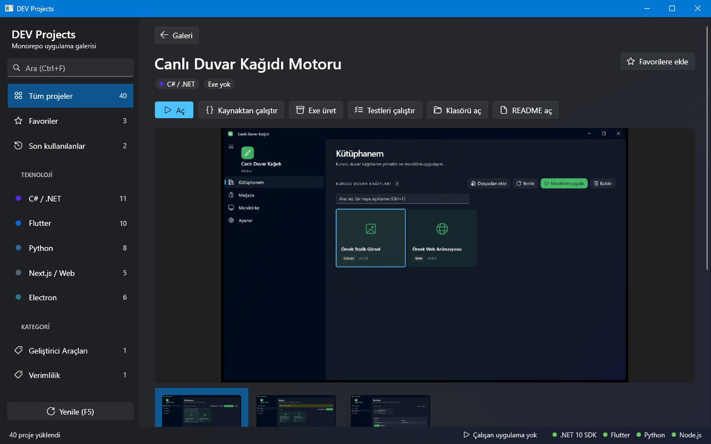

# Proje Launcher

Bu monorepodaki 40 uygulamayı ekran görüntülü kartlarla listeleyen, arayıp süzen ve tek tıkla açan WPF galeri (`DevProjects.exe`).




## Özellikler

- **Galeri:** her projeye kart — `docs/ekran.png` küçük resmi (yoksa yığın renginde gradyan + baş harfler), ad, tek satır açıklama, yığın rozeti, exe durumu, "Çalışıyor" etiketi.
- **Kenar çubuğu:** Tüm projeler, Favoriler, Son kullanılanlar; teknolojiye (.NET, Flutter, Python, Web, Electron) ve `assets/manifest.json` `category` alanına göre gruplar (sayılarla).
- **Arama:** ad, açıklama, etiket, klasör, kategoride; Türkçe harf duyarsız (`ogrenme` → "Öğrenme", `ISIK` → "ışık"), çok kelime = hepsi.
- **Exe filtresi:** Hepsi / Exe var / Exe yok.
- **Detay sayfası:** büyük ekran görüntüleri (`docs/ekran*.png` şeridi), açıklama, README girişi ve "Özellikler" maddeleri, etiketler, klasör ve exe yolu.
- **Eylemler:** Aç (exe varsa exe, yoksa kaynaktan), Kaynaktan çalıştır (`launcher.ps1 -Exec`), Exe üret (`launcher.ps1 -Publish`), Testleri çalıştır (`run.ps1 -Check`), Klasörü aç, README aç. Konsol işleri yeni PowerShell penceresinde açılır.
- **Durum çubuğu:** dist altından çalışan uygulamalar (3 sn'de bir) ve araç zinciri (`launcher.ps1 -Doctor` ile aynı denetimler).
- **Kalıcılık:** favoriler + son 10 kullanılan proje.
- **Görünüm:** WPF Fluent teması (Windows açık/koyu + vurgu rengi), DPI'ya göre küçük resim çözme, dar pencerede daralan kenar çubuğu.

## Hızlı başlangıç

```powershell
..\DevProjects.exe             # yayınlanmış tek dosya exe (repo kökünde)
..\launcher.ps1 -Wpf           # kök launcher'dan aç (exe yoksa kaynaktan)
.\run.ps1                      # Debug derler ve açar (-Release, -NoBuild)
.\run.ps1 -Check               # birim testleri (pencere açmaz)
.\run.ps1 -UiTest              # FlaUI arayüz testleri (sahte repo, pencere açar)
.\publish.ps1                  # tek dosya, self-contained DevProjects.exe -> repo kökü (+ açılış testi)
```

Exe üretme: `.\publish.ps1` → `..\DevProjects.exe` (bu proje istisna olarak `dist\` yerine repo köküne yazar;
kök `launcher.ps1 -Wpf` ve kullanıcılar onu orada arar).

## Kullanım

Bir kartı seçin; **Enter**, çift tık veya ⓘ düğmesi detay sayfasını açar. Detayda eylem düğmeleri bulunur;
kart üzerindeki ▷ ya da **Ctrl+Enter** projeyi doğrudan açar. Yıldız favorilere ekler.

| Kısayol | İşlev |
|---|---|
| Ctrl+F | Arama kutusu |
| ↓ (arama kutusunda) | İlk karta geç |
| Ok tuşları | Kartlar arasında gezin |
| Enter | Seçili kartın detayı |
| Ctrl+Enter | Seçili projeyi aç |
| Esc | Detayı kapat → aramayı temizle → filtreleri sıfırla |
| Geri silme / Alt+← | Detaydan galeriye dön |
| F5 | Yenile (exe durumu, yeni ekran görüntüleri) |

## Veri ve gizlilik

- Favoriler ve son kullanılanlar: `%LOCALAPPDATA%\DevProjects\state.json` (geçici dosyaya yazılıp taşınır; bozuk dosya
  `state.json.bad` olarak saklanır ve boş durumla devam edilir).
- Ortam değişkenleri: `DEVPROJECTS_ROOT` (repo kökü), `DEVPROJECTS_STATE_DIR` (durum klasörü),
  `DEVPROJECTS_THEME=Light|Dark` (temayı zorla). Testler ilk ikisiyle geçici klasör kullanır.
- Ağ erişimi yok. Arayüzde mutlak yol gösterilmez (yalnızca klasör adı ve `dist\...` göreli yolu).

## Mimari / analiz

- **Yığın:** .NET 10, WPF (`ThemeMode="System"` Fluent), CommunityToolkit.Mvvm 8.4.2.
  Testler: xunit.v3 4.0.1 (Microsoft.Testing.Platform, `global.json`), FlaUI.UIA3 5.0.0.
- **Klasörler:**

```
ProjeLauncher/
├── Models/ProjectEntry.cs        # proje kaydı (+ IsFavorite / IsRunning / Thumbnail gözlemlenebilir)
├── Services/
│   ├── RepoRoot.cs               # DEVPROJECTS_ROOT ya da exe'den yukarı: .devprojects-root / launcher.ps1
│   ├── ProjectCatalogService.cs  # klasör tarama, yığın algılama, manifest/README, exe, ekran görüntüleri
│   ├── ProjectFilter.cs          # kapsam + exe filtresi + arama (saf fonksiyon)
│   ├── TurkishText.cs            # Türkçe harf duyarsız katlama
│   ├── StateStore.cs             # state.json (atomik yazım, bozuk dosya toleransı)
│   ├── ProjectLaunchService.cs   # eylemler için ProcessStartInfo (birim testlenir)
│   ├── SystemStatus.cs           # araç zinciri + çalışan süreçler
│   └── ImageLoader.cs            # arka planda DecodePixelWidth ile PNG çözme
├── ViewModels/MainViewModel.cs   # gezinme, filtre, detay, komutlar
└── MainWindow.xaml(.cs)          # galeri, detay, kısayollar, kart genişliği
ProjeLauncher.Tests/              # birim + FlaUI testleri, FakeRepo
```

- **Veri akışı:** açılışta pencere hemen görünür; katalog `Task.Run` ile taranır (paralel), kartlar eklenir,
  küçük resimler 4 iş parçacığıyla `DecodePixelWidth = 360 × DPI` çözülüp dondurulur. Detay görüntüleri seçimde
  yüklenir. Çalışan süreç taraması ve `dotnet --list-sdks` denetimi arka planda.
- **Kararlar:** başlatma her zaman kök `launcher.ps1` üzerinden (araç denetimi, hata olursa pencere açık kalır);
  `ProcessStartInfo.ArgumentList` ile tırnaklama sorunu yok. Görseller belleğe okunur — diğer süreçler
  `ekran.png`'yi yeniden yazarken dosya kilitlenmez. 40 kart için sanallaştırma gerekmedi (WrapPanel).

## Testler

| Tür | Sayı | Komut |
|---|---|---|
| Birim (katalog, arama/Türkçe, durum, başlatma argümanları, view model) | 36 | `.\run.ps1 -Check` |
| Arayüz (FlaUI: arama, filtre, seçim, detay, başlatma, favori, klavye) | 2 | `.\run.ps1 -UiTest` |

Arayüz envanteri: [docs/arayuz-testi.md](docs/arayuz-testi.md). UI testleri sahte repo kökünde çalışır; sahte
`launcher.ps1` yalnızca `launched.txt` yazar, gerçek proje başlatılmaz.

## Bilinen sınırlar ve yol haritası

- Çalışıyor tespiti süreci exe adıyla arar; dist altından farklı adla başlayan yardımcı süreçler sayılmaz,
  kaynaktan (`run.ps1`) çalışanlar gösterilmez.
- Exe ikonu yok (varsayılan WPF ikonu).
- Kart listesi sanallaştırılmıyor; yüzlerce projede `VirtualizingWrapPanel` gerekir.
- Yol haritası: sıralama seçenekleri (ad / son kullanım), kart boyutu seçimi, toplu "tümünü yayınla".
