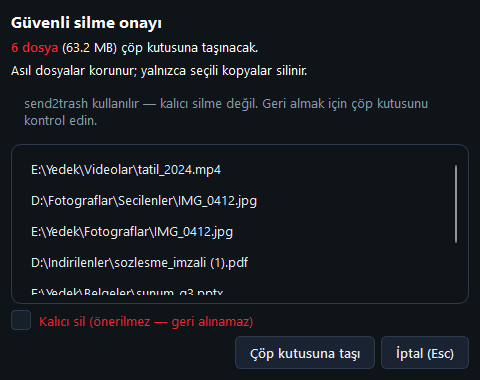

# Tekrarlanan Dosya Bulucu

Aynı içeriğe sahip dosyaları SHA-256 ile bulup kopyaları güvenle Geri Dönüşüm Kutusu'na taşıyan PySide6 masaüstü uygulaması.


## Özellikler
- **Tarama:** birden çok kök klasör (sürükle-bırak, `Ctrl+O`); boyut → ilk 64 KB → tam SHA-256 ile kesin eşleşme; paralel hash; SQLite önbellek; gizli/sistem klasörü, uzantı ve en küçük boyut filtreleri; sert bağlantılar ayrı işaretlenir.
- **Benzer görseller:** pHash modu (isteğe bağlı Pillow + ImageHash).
- **Karar desteği:** hangi kopyanın tutulacağı önerisi (en eski / en yeni / en kısa yol); **korunan klasörler** asla silinmeye işaretlenmez; tümünü seç / temizle / tersine çevir.
- **Görünümler:** kart (≤80 grup), ağaç (80+), sanal kompakt liste (eşik üstü); yol filtresi (`Ctrl+F`), sıralama, sayfalama; PDF/görsel önizleme ipucu.
- **Silme:** onay diyaloğu, Geri Dönüşüm Kutusu (kalıcı silme ikinci onayla); yalnızca gerçekten silinenler listeden düşer.
- **Kayıt:** JSON / CSV / HTML dışa aktarma, oturum kaydet/yükle, tarama geçmişi, zamanlanmış tarama (tepsi bildirimi), kapatınca tepsiye küçültme.
- **Entegrasyon:** tek örnek; ikinci açılış ve Disk Alanı Görselleştirici kökleri IPC ile çalışan pencereye iletir.
- **Erişilebilirlik:** koyu tema, tüm onay kutularında ekran okuyucu adları, grup kartları klavyeyle açılır.



## Hızlı başlangıç
| Ne | Komut |
|---|---|
| Hazır exe | `dist\tekrarlanan-dosya-bulucu\TekrarlananDosyaBulucu.exe` |
| Kaynaktan çalıştır | `.\run.ps1` (`.venv` kurar) · `.\run.ps1 --roots "D:\Foto;E:\Yedek" --scan` |
| Testler | `.\run.ps1 -Check` (birim + entegrasyon, pencere açmaz) |
| Arayüz testleri | `.\run.ps1 -UiTest` (pytest-qt, gerçek pencereler) |
| Exe üretme | `.\publish.ps1` → `dist\tekrarlanan-dosya-bulucu\` (testleri çalıştırır, pHash/PDF paketlerini dahil eder) |
| Kurulum / kaldırma | `.\install.ps1` (`%LocalAppData%\Programs\` + masaüstü kısayolu) · `.\uninstall.ps1` |
| Ekran görüntüleri | `.\.venv\Scripts\python.exe scripts\ekran_goruntusu.py` (örnek verilerle, ekranı kopyalamadan) |

İsteğe bağlı pHash/PDF önizleme (kaynaktan): `.\.venv\Scripts\pip install -r requirements-optional.txt`. Takılı süreçler: `.\stop.ps1`. Linux/macOS: `./run.sh`.

## Kullanım
1. Kök klasörleri ekleyin (sürükleyin ya da `Ctrl+O`); yanlış eklenen kökü seçip `Delete` / "− Seçili kökü kaldır".
2. `F5` ile tarayın. Öneri, her grupta bir "Asıl" dosyayı tutar, kopyaları "Silinecek" olarak işaretler.
3. Kartlarda onay kutularıyla düzeltin, `Ctrl+F` ile yol arayın, gerekirse Ayarlar'dan korunan klasör ekleyin.
4. "Seçilileri sil" / `Delete` → onay → Geri Dönüşüm Kutusu.

| Kısayol | İşlev |
|---|---|
| `F5` | Tara (seçili mod: Byte / pHash) |
| `Esc` | Taramayı iptal et |
| `Delete` | Seçili kopyaları sil · kök listesi odaktaysa kökü kaldır |
| `Ctrl+O` | Kök klasör ekle |
| `Ctrl+F` | Sonuçlarda yol ara |
| `Ctrl+,` | Ayarlar |
| `Ctrl+E` / `Ctrl+Shift+E` / `Ctrl+Shift+H` | JSON / CSV / HTML dışa aktar |
| `Space` / `Enter` | Odaktaki grup kartını aç-kapat; kompakt listede grup detayı |
| `F1` | Yardım |

## Veri ve gizlilik
- `%LocalAppData%\TekrarlananDosyaBulucu\`: `settings.json`, `scan_cache.db`, `scan_history.json`, `handoff.json`, `app.log`.
- `TEKRARLANAN_DATA_DIR` bu klasörü, `TEKRARLANAN_IPC_NAME` yerel IPC kanal adını değiştirir (testler gerçek veriye ve çalışan uygulamaya dokunmaz).
- Ağ erişimi yok; IPC yalnızca yerel adlandırılmış kanal (QLocalServer). Telemetri yok.

## Mimari / analiz
- **Yığın:** Python 3.13, PySide6 6.11.2, Send2Trash 2.1.0; isteğe bağlı Pillow 12.3, ImageHash 4.3.2, pypdf 6.19; PyInstaller 6.22.3 (onedir); test: pytest 9.1.1 + pytest-qt 4.5.0.
- **Klasörler:**
  ```
  main.py            tek örnek (mutex), IPC sunucusu, tepsi, CLI (--roots, --scan, --handoff, --forward-handoff, --version)
  ui/main_window.py  menüler, kısayollar, tarama akışı, silme
  ui/widgets/        kart (duplicate_group_widget), ağaç, kompakt liste, tarama paneli, boş durum
  ui/dialogs/        ayarlar, silme onayı, grup detayı, geçmiş, yardım, hakkında
  utils/             duplicates (motor), scan_worker/image_scan_worker (QThread), scan_cache, export, session,
                     handoff + ipc (köprü), settings, filter/sort, image_similarity, preview
  scripts/           ekran_goruntusu.py
  tests/             birim/entegrasyon; tests/ui/ pytest-qt arayüz testleri
  ```
- **Veri akışı:** kökler → `ScanWorker` (QThread) → `find_duplicates` (boyut grupla → kısmi hash → tam SHA-256, iş parçacığı havuzu) → önbelleğe yaz → `apply_keep_strategy` (+ korunan klasörler) → görünüm seçimi (kart/ağaç/kompakt) → işaretler → `move_to_trash`.
- **Köprü:** `disk-alan-gorsellestirici/core/tekrarlanan_bridge.py` `handoff.json` yazar ve `dist\tekrarlanan-dosya-bulucu\TekrarlananDosyaBulucu.exe --forward-handoff --handoff` dener; olmazsa `--handoff` ile başlatır. Exe adı/konumu ve bu argümanlar sabit tutulmalı.
- **Kararlar:** yanlış pozitif riski yok (tam hash doğrulaması); sert bağlantılar alan kazandırmadığı için silinemez; büyük sonuçlarda widget sayısı sınırlı (sayfalama + sanal liste).

## Testler
- `.\run.ps1 -Check`: 38 test (37 geçer, 1 platforma bağlı atlanır) — motor, önbellek, dışa aktarma, köprü/IPC, korunan klasörler, pencere duman testi.
- `.\run.ps1 -UiTest`: 19 pytest-qt testi — ana pencere, tüm menüler/kısayollar ve diyaloglar. Envanter: [docs/arayuz-testi.md](docs/arayuz-testi.md).

## Bilinen sınırlar ve yol haritası
- Silinen dosyaları uygulama içinden geri alma yok (Geri Dönüşüm Kutusu'ndan geri yüklenir).
- Tarama sırasında toplam dosya sayısı bilinmediği için ilerleme belirsiz çubukla gösterilir.
- pHash modu ve PDF önizleme isteğe bağlı paketler gerektirir (exe'de dahil); exe klasörü bu yüzden ~240 MB.
- Plan: BLAKE3 / Rust motor (v2), açık tema.
